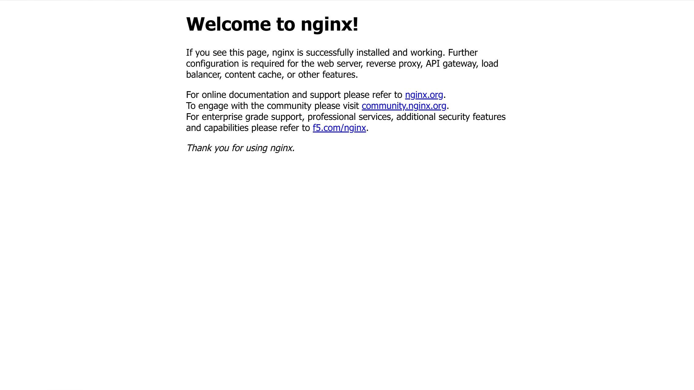

## 简介：Docker 与 Docker Compose

要了解 Docker 与 Docker Compose，不妨先从一些常见的开发和部署难题说起。

### Docker

在开发项目时，我们经常会遇到这样的问题：

- 本地开发环境能运行，但是在服务器上无法运行
- 本机装的是 `Python 3.12`，服务器上只有 `Python 3.10`；或是服务器上的 `glibc` 等动态链接库版本过低，连最基础的服务都无法运行，而更新 `glibc` 简直就是一种折磨
- 项目依赖 Redis、MySQL、RabbitMQ 等多种服务，每换一台机器都要重新安装一遍
- 多个项目依赖的运行时版本不同，装在同一台机器上容易互相影响

Docker 试图解决的正是这些问题。它让我们不再只交付一份代码，而是交付一套相对完整、稳定的应用运行环境。

为此，Docker 提供了一套用于开发、打包、分发和运行应用程序的工具和平台。它最常见的用法，是把应用程序及其运行环境一起打包成一个镜像，然后在不同机器上以容器的形式运行。简单来说，**Docker 将应用程序与所需依赖封装在一起，使其能够在不同机器上以尽量一致的方式运行**。


Docker 的标志是一只背着集装箱的鲸鱼，这个设计借用了现代物流中的集装箱理念。标准集装箱不关心里面装的是机器、食品还是日用品；只要符合统一规格，就可以方便地在轮船、火车和卡车之间运输。

Docker 希望为应用程序提供类似的标准化交付方式：开发者将应用及其运行所需的依赖构建为镜像，再以容器的形式运行。这样，同一份镜像就可以更方便地在开发、测试和生产环境之间分发，并尽可能保持一致的运行环境。

> **Docker 的历史**
>
> Docker 的故事最早并不是从 Docker 公司开始的，而是从一家叫 dotCloud 的 PaaS（Platform as a Service，平台即服务）公司开始的。
>
> dotCloud 的创始人之一 Solomon Hykes 最初想做的是一个云平台：开发者把代码交给平台，平台负责构建、部署和运行。这个想法听起来很理想，但问题在于，不同的编程语言、依赖库、系统工具和运行环境的应用很难被统一管理。为了解决这个问题，dotCloud 内部开发了一套工具，用来将应用程序和它所依赖的运行环境隔离、封装起来。后来，这套工具逐渐演变成了 Docker。
>
> 2013 年，Docker 在 PyCon 上首次公开亮相，并很快开源。凭借简单、清晰且实用的容器化理念，Docker 迅速受到开发者欢迎。后来，dotCloud 也干脆改名为 “Docker Inc.”，专注容器技术开发。

### Docker Compose

Docker 负责运行容器，但现实中的应用往往不是由单个容器组成的。

例如，一个完整的 Web 应用可能同时包含前端、后端、数据库、缓存、反向代理等多个服务。这些服务彼此配合，构成了一套完整的应用。如果使用 Docker，在启动服务时就需要分别启动每一个容器，并为它们逐个指定端口、环境变量、数据目录、网络等配置。随着服务数量增加，命令会变得越来越长，也越来越难维护。

Docker Compose 正是为了解决这个问题而出现的。它允许我们用一个配置文件描述一组相关服务，然后用一条命令启动、停止和管理整套应用。

简单来说，**Docker Compose 可以把一系列相关的容器组织在一起，用一个配置文件和一组命令统一管理。**

## 核心概念

在正式安装和使用 Docker 之前，有必要先了解几个最常见的概念。理解这些概念后，再阅读后面的 Docker 命令和 Compose 配置文件会容易得多。

本节会先介绍 Docker 中的几个基础概念，然后再简单介绍 Docker Compose 中最常见的配置项。

### Docker 核心概念

首先要澄清的是，Docker 容器不是虚拟机。

虚拟机会虚拟出一整套硬件和操作系统；而容器与宿主机共享硬件和操作系统内核，只对进程、文件系统、网络等资源进行隔离。因此，容器更轻量，启动更快，占用资源也更少。不过，容器并不是虚拟机的完全替代品。虚拟机隔离级别更高，适合运行不同操作系统内核；容器则更适合封装和运行应用服务。

了解 Docker 前，先要理解以下几个核心概念：镜像、容器、仓库、Dockerfile、数据卷和网络。

#### 镜像（Image）

镜像可以理解为一个用于创建容器的只读模板，预先打包了应用运行所需的基础环境、运行时、依赖库、应用文件以及默认启动方式等内容。

镜像既可以从公共镜像仓库中获取，也可以由开发者基于自己的应用自行构建。

#### 容器（Container）

容器是由镜像创建出来的运行实例。同一个镜像可以创建多个容器，这些容器彼此独立，互不影响。

简单来说，**镜像负责定义环境，容器负责运行应用**。

#### 仓库（Registry）

仓库是镜像的下载和发布平台，用于存放和分发镜像。

最常见的公共镜像仓库是 Docker Hub。许多常用软件都会在 Docker Hub 提供官方镜像，例如 Nginx、MySQL、Redis、RabbitMQ 等。除了公共镜像仓库，团队或企业内部也可以搭建私有镜像仓库，用来保存自己的业务镜像。这样可以更方便地在开发、测试和生产环境之间分发应用。

#### Dockerfile

Dockerfile 是用于构建镜像的文本文件。

它描述了一个镜像应该如何生成，例如从哪个基础镜像开始、复制哪些应用文件、安装哪些依赖、设置哪些环境变量，以及容器启动时默认执行什么操作。开发者可以通过 Dockerfile 固化应用程序和运行环境，从而让镜像的构建过程变得清晰、可重复。

在团队协作中，Dockerfile 非常重要。任何人可以根据同一份 Dockerfile 构建出一致的镜像。

#### 数据卷（Volume）

容器适合运行程序，但不适合直接保存重要数据。因为容器可能会被停止、删除或重建，如果数据只存放在容器内部，容器删除后数据也会随之丢失。

为了解决这个问题，Docker 提供了数据卷。数据卷独立于容器存在，用于保存数据库文件、用户上传文件等需要长期保留的数据。即使容器被删除，只要数据卷仍然存在，数据就可以继续使用。

例如，数据库容器通常会将数据文件保存到数据卷中，以便在升级或重建容器时保留原有数据。

简单来说，**容器负责运行程序，数据卷负责保存数据**。

#### 绑定挂载（Bind Mount）

除了使用 Docker 管理的数据卷，也可以把主机上的某个目录直接挂载到容器中，这种方式称为绑定挂载。绑定挂载的特点是：容器内部可以直接访问主机上的文件或目录。主机上的文件发生变化，容器内也能看到对应变化。

这种方式在开发场景中很常见。例如，可以把本地项目源码目录挂载到容器中，让容器使用最新的代码运行；也可以把配置文件挂载到容器中，方便在主机上直接修改配置。

一般来说：

- 数据卷更适合保存数据库、上传文件等长期数据；
- 绑定挂载更适合开发调试、挂载源码或配置文件。

#### 网络（Network）

容器可以通过 Docker 网络彼此通信。对于需要协同工作的多个容器，通常会将它们加入同一个用户自定义网络中。这样，容器之间就能够通过 Docker 提供的名称解析机制互相访问。

例如，在一个包含后端服务和 Redis 缓存的 Web 应用中，后端服务需要访问 Redis，此时就需要让这两个容器加入同一个网络。加入同一网络后，容器之间可以直接通过容器名称互相访问。

在实际项目中，网络通常用于组织一组相关容器，例如前端、后端、数据库、缓存和反向代理等。它们通过 Docker 网络互相连接，共同组成完整的应用系统。

### Docker Compose 配置项

如果说 Docker 主要负责运行单个容器，那么 Docker Compose 更关注如何组织和管理一组相关容器。

Docker Compose 的核心配置文件通常命名为 `compose.yml` 或 `docker-compose.yml`。其中，`compose.yml` 是新版 Compose 更推荐的文件名，而 `docker-compose.yml` 仍然非常常见，也被广泛兼容。

一个 Compose 配置文件通常由以下几类配置组成。

- `services`：定义要运行的服务。每个服务会指定使用哪个镜像，或者如何通过 Dockerfile 构建镜像。一个服务通常对应一个容器。

- `image`：指定服务使用的镜像。

  如果服务可以直接基于已有镜像运行，就可以使用 `image` 指定镜像名称。例如 `nginx:alpine`、`mysql:8`、`redis:alpine` 等。创建容器时，Docker 会先检查本地是否已有该镜像；如果本地没有，则会根据镜像名称中指定的仓库地址拉取镜像；对于没有显式指定仓库地址的镜像，则默认会从 Docker Hub 拉取。

- `build`：指定如何根据 Dockerfile 构建镜像。

  如果项目需要使用自己编写的 Dockerfile 构建镜像，可以使用 `build`，并指向 Dockerfile 所在目录。相对来说，`image` 更适合直接使用现成镜像，而 `build` 更适合构建自己的应用镜像。

- `container_name`：指定创建容器的名称。

  如果不设置该项，Docker Compose 会根据项目名、服务名和序号自动生成容器名称。手动设置 `container_name` 可以让容器名称更直观，但在需要创建多个同类容器时，不建议固定容器名。

- `restart`：配置容器的重启策略。取值包括：

  - `"no"`：默认值，不自动重启容器；
  - `always`：Docker 服务启动后，以及容器退出后，均会自动启动该容器；
  - `unless-stopped`：除非手动停止，否则会在 Docker 服务启动后，以及容器退出后自动启动该容器；
  - `on-failure`：仅在容器异常退出时自动重启。

  在个人部署或服务器长期运行场景中，`unless-stopped` 是比较常用的选择。

- `ports`：配置端口映射。

  默认情况下，容器内部服务只在容器所在网络内监听。如果希望从主机访问容器中的服务，就需要通过 `ports` 将主机端口映射到容器端口。

- `environment`：配置容器中应用的环境变量。

  很多镜像可以通过环境变量完成初始化配置，例如数据库密码、默认用户名、运行模式、服务端口等。使用环境变量可以避免把配置写死在镜像中，使同一个镜像更容易在不同环境中复用。

- `volumes`：配置数据卷或绑定挂载。

  容器本身可以被删除、重建或替换，因此重要数据通常不应该只保存在容器内部。通过 `volumes` 配置，可以把数据保存到 Docker 数据卷中，也可以把主机上的目录挂载到容器中。一般来说，数据库文件、上传文件等长期数据适合使用数据卷；源码、配置文件等开发时经常修改的内容适合使用绑定挂载。

- `networks`：配置容器网络。

  多个服务之间如果需要互相通信，通常会加入同一个网络。加入同一网络后，服务之间可以通过服务名访问彼此。

  Compose 默认会为当前项目创建一个网络，并可以直接通过服务名互相访问，因此在简单场景下可以不手动配置 `networks`。但如果需要更清晰地组织多个服务，或者连接到外部已有网络，就可以显式配置网络。

- `depends_on`：声明服务之间的依赖关系。

  需要注意的是， 使用简单写法时，`depends_on` 仅控制容器的创建和启动顺序，被依赖服务不一定已经完成初始化。如果确实需要等待其他服务可用，可以为其他服务配置健康检查，并结合 `condition: service_healthy` 使用。

总体来说，Docker Compose 配置文件的作用，就是把原本需要通过多条 `docker run` 命令手动指定的内容，统一整理成一份结构化的配置文件。这样不仅更容易阅读和维护，也方便在不同机器之间复用同一套部署配置。

一个简单的 Compose 配置文件如下：

```yaml title="compose.yml" frame="code"
services:
  web:
    image: nginx:alpine
    container_name: demo-nginx
    ports:
      - "8080:80"
    volumes:
      - ./html:/usr/share/nginx/html
    restart: unless-stopped
```

这个配置文件描述了一个名为 `web` 的服务。它使用 `nginx:alpine` 镜像，将主机的 `8080` 端口映射到容器的 `80` 端口，并把当前目录下的 `html` 文件夹挂载到容器中的 Nginx 静态文件目录。

之后，只需要在该配置文件所在目录运行：

```bash frame="terminal"
docker compose up -d
```

Docker Compose 就会根据配置文件创建并启动对应的服务。随后访问 `http://localhost:8080`，就可以看到 Nginx 服务的页面了。

> [!NOTE]
>
> 旧版 Docker Compose 的命令是 `docker-compose`，新版 Docker Compose V2 推荐使用 `docker compose`。现在更推荐使用新版的 `docker compose` 命令。

## 安装和配置 Docker

本文分别介绍在 Linux 和 Windows 环境中安装 Docker 的常见方式。

- 在 Linux 服务器上，直接安装 Docker Engine，并通过 Docker Compose 插件提供 `docker compose` 命令。
- 在 Windows 中，推荐使用 Docker Desktop。Docker Desktop 会同时提供 Docker Engine、Docker CLI 和 Docker Compose，并通过 WSL 2 或 Hyper-V 后端运行 Linux 容器。

### 在 Linux 中安装 Docker

下面以 Debian 为例，介绍 Docker Engine 和 Docker Compose 的安装方式。

> [!NOTE]
>
> 以下命令参考 Docker 官方文档整理。不同发行版、不同版本的命令可能略有差异。

#### 安装 Docker 及 Docker Compose

首先，卸载可能存在的软件包残留：

```bash frame="terminal"
sudo apt remove docker docker-engine docker.io containerd runc 2>/dev/null
```

接着更新软件包索引，并安装一些必要依赖：

```bash frame="terminal"
sudo apt update
sudo apt install -y curl vim wget gnupg dpkg apt-transport-https lsb-release ca-certificates
```

然后添加 Docker 官方 GPG 公钥和 Docker 官方 apt 源：

```bash frame="terminal" wrap
curl -fsSL https://download.docker.com/linux/debian/gpg | sudo gpg --dearmor -o /usr/share/keyrings/docker-ce.gpg
echo "deb [arch=$(dpkg --print-architecture) signed-by=/usr/share/keyrings/docker-ce.gpg] https://download.docker.com/linux/debian $(lsb_release -sc) stable" | sudo tee /etc/apt/sources.list.d/docker.list > /dev/null
```

> [!TIP]
>
> 如遇到网络问题，可以改用 [清华大学开源软件镜像站 | Tsinghua Open Source Mirror](https://mirrors.tuna.tsinghua.edu.cn/) 的镜像源：
>
> ```bash
> curl -fsSL https://download.docker.com/linux/debian/gpg | sudo gpg --dearmor -o /usr/share/keyrings/docker-ce.gpg
> echo "deb [arch=$(dpkg --print-architecture) signed-by=/usr/share/keyrings/docker-ce.gpg] https://mirrors.tuna.tsinghua.edu.cn/docker-ce/linux/debian $(lsb_release -sc) stable" | sudo tee /etc/apt/sources.list.d/docker.list > /dev/null
> ```

之后可以直接安装 Docker 和 Docker Compose 了：

```bash frame="terminal"
sudo apt update
sudo apt install -y docker-ce docker-ce-cli containerd.io docker-compose-plugin
```

> [!NOTE]
>
> Docker Compose 可以作为 Docker 插件 `docker-compose-plugin` 安装，也能以 `docker-compose` 软件包单独安装，区别如下：
>
> |        安装方式         |     安装版本      |     启动命令     |
> | :---------------------: | :---------------: | :--------------: |
> | `docker-compose-plugin` | Docker Compose V2 | `docker compose` |
> |    `docker-compose`     | Docker Compose V1 | `docker-compose` |
>
> 旧版的 Docker Compose V1 在一些老项目或旧环境中仍然可以见到，但目前已不推荐使用。
>
> 本文中使用 Docker Compose V2，即 `docker compose` 命令。

#### 验证安装

安装完成后，可以通过以下命令验证 Docker 和 Docker Compose 是否安装成功，并查看当前版本：

```bash frame="terminal"
sudo docker version
sudo docker compose version
```

如果能够正常输出 Docker 和 Docker Compose 的版本信息，说明基础环境已经可用。

#### （可选）使用国内镜像加速 Docker

如果拉取镜像速度较慢，可以使用如下命令添加国内镜像。

> [!WARNING]
>
> 以下镜像地址由第三方服务提供，其可用性、安全性和同步状态可能发生变化。使用前请自行确认服务来源；如果镜像拉取异常，应暂时移除对应地址并重新测试。
>
> 如果 `/etc/docker/daemon.json` 已经存在，请将下面的 `registry-mirrors` 字段合并到现有配置中，不要直接覆盖原文件。修改前建议先备份配置：
>
> ```bash frame="terminal"
> sudo cp /etc/docker/daemon.json /etc/docker/daemon.json.bak
> ```

```bash frame="terminal"
sudo mkdir -p /etc/docker

sudo tee /etc/docker/daemon.json <<-'EOF'
{
    "registry-mirrors": [
        "https://docker.1ms.run",
        "https://dockercf.jsdelivr.fyi/",
        "https://docker.m.daocloud.io"
    ]
}
EOF

sudo systemctl daemon-reload
sudo systemctl restart docker
```

配置完成后，Docker 在拉取镜像时会尝试使用这些镜像加速地址。

#### 将当前用户加入 docker 用户组

默认情况下，普通用户在使用 `docker` 命令前，每次都需要添加 `sudo` 前缀。通过将当前用户加入 `docker` 用户组，可以让当前用户直接运行 `docker` 命令。

> [!WARNING]
>
> 注意，加入 `docker` 用户组后，当前用户可以直接控制 Docker 服务，通常等同于拥有较高的系统权限。因此只建议将可信用户加入该用户组。

安装 Docker 后通常会自动创建 `docker` 用户组。如果没有创建，也可以手动执行：

```bash frame="terminal"
sudo groupadd docker
```

如果提示 `groupadd: group 'docker' already exists`，说明 `docker` 用户组已存在，可以忽略。

然后将当前用户加入 `docker` 用户组中：

```bash frame="terminal"
sudo usermod -aG docker $USER
```

注销并重新登录当前用户，或使用以下命令刷新 `docker` 用户组权限：

```bash frame="terminal"
newgrp docker
```

之后可以尝试不加 `sudo` 执行：

```bash frame="terminal"
docker version
```

如果能够正常输出 Docker 版本信息，说明当前用户已经可以直接使用 Docker。

### 在 Windows 中安装 Docker

在 Windows 中，推荐使用 Docker Desktop 安装和管理 Docker。Docker Desktop 会同时提供 Docker Engine、Docker CLI 和 Docker Compose，并通过 WSL 2 或 Hyper-V 后端运行 Linux 容器。

在 Windows 上，可以直接运行 Windows 容器。但如果想要在 Windows 上运行 Linux 容器，需要通过 WSL 2 或 Hyper-V 向 Docker Desktop 提供 Linux 内核环境。在大多数情况下，推荐优先使用 WSL 2 后端，以获得更好的性能和兼容性。更多说明可以参考 Docker 官方文档：[Docker Desktop WSL 2 backend on Windows | Docker Docs](https://docs.docker.com/desktop/features/wsl/)。

如果已经使用 Docker Desktop，并以 WSL 2 后端运行，不建议在 WSL 发行版内部再单独安装 Docker Engine，否则可能会导致命令指向混乱、端口冲突或服务状态不一致。通常情况下，让 WSL 使用 Docker Desktop 提供的 Docker 环境即可。

> [!NOTE]
>
> Docker Desktop 对个人学习、小团队和开源项目通常很方便。但 Docker Desktop 的商业使用许可有一定条件，大型企业或商业组织使用前，建议先确认其许可要求。

#### 安装或更新 WSL 2

通常情况下，Docker Desktop 通过 WSL 2 后端运行 Linux 容器，因此需要先确保系统已经安装并启用 WSL 2。

在较新的 Windows 10 或 Windows 11 中，可以直接以管理员身份打开 PowerShell，执行：

```powershell frame="terminal"
wsl --install
```

该命令会自动启用 WSL 相关组件，并安装默认的 Linux 发行版。如果希望指定安装 Ubuntu，也可以执行：

```powershell frame="terminal"
wsl --install -d Ubuntu
```

> [!TIP]
>
> 如果当前系统不支持 `wsl --install`，或者执行过程中遇到问题，也可以手动启用 WSL 相关组件。
>
> 以管理员身份打开 PowerShell，执行：
>
> ```powershell frame="terminal"
> dism.exe /online /enable-feature /featurename:Microsoft-Windows-Subsystem-Linux /all /norestart
> dism.exe /online /enable-feature /featurename:VirtualMachinePlatform /all /norestart
> ```
>
> 然后重启：
>
> ```powershell frame="terminal"
> shutdown /r /t 0
> ```
>
> 重启后，继续执行：
>
> ```powershell frame="terminal"
> wsl --set-default-version 2
> wsl --install -d Ubuntu
> ```

如果已经安装过 WSL，可以执行以下命令更新 WSL：

```powershell frame="terminal"
wsl --update
```

然后可以使用如下命令查看当前 WSL 状态：

```powershell frame="terminal"
wsl --status
```

这会指示当前默认发行版，以及默认 WSL 版本。

使用如下命令查看已经安装的 Linux 发行版及其 WSL 版本：

```powershell frame="terminal"
wsl -l -v
```

如果某个发行版仍然使用 WSL 1，可以使用如下命令将其转换为 WSL 2：

```powershell frame="terminal"
wsl --set-version <distribution-name> 2
```

其中，`<distribution-name>` 需要替换为实际的发行版名称，例如 `Ubuntu`。

#### 安装 Docker Desktop

首先，访问 Docker 官方网站 [Install Docker Desktop on Windows | Docker Docs](https://docs.docker.com/desktop/setup/install/windows-install/) 下载 Docker Desktop for Windows。

下载完成后，运行安装程序，在安装过程中注意勾选 **Use WSL 2 instead of Hyper-V**。

安装完成后，按照以下步骤启动 Docker Desktop 并进行部分设置的确认：

1. 从开始菜单启动 Docker Desktop，然后打开 Settings（齿轮图标）
2. 在 General 页面中，确认与 WSL 2 后端相关的选项已启用
3. 在 Resources 页面中，在 WSL Integration 标签中启用需要使用 Docker 的 WSL 发行版
4. 点击 Apply & Restart

#### 验证安装

安装完成后，可以在 PowerShell、Windows Terminal 或 WSL 终端中执行以下命令，验证 Docker 和 Docker Compose 是否安装成功：

```bash frame="terminal"
docker version
docker compose version
```

如果能够正常输出 Docker 和 Docker Compose 的版本信息，说明基础环境已经可用。

#### （可选）使用国内镜像加速 Docker

> [!WARNING]
>
> 以下镜像地址由第三方服务提供，其可用性、安全性和同步状态可能发生变化。使用前请自行确认服务来源；如果镜像拉取异常，应暂时移除对应地址并重新测试。

如果拉取镜像速度较慢，可以通过如下步骤添加国内镜像：

1. 从开始菜单启动 Docker Desktop，然后打开 Settings（齿轮图标）

2. 在 Docker Engine 页面中，在 JSON 配置中添加或合并 `registry-mirrors` 配置。注意，修改时应注意保持 JSON 格式正确，不要重复添加同名字段，也不要误删已有的重要配置。示例配置如下：

   ```json
   {
     "builder": {
       "gc": {
         "defaultKeepStorage": "20GB",
         "enabled": true
       }
     },
     "experimental": false,
     "registry-mirrors": [
       "https://docker.1ms.run",
       "https://dockercf.jsdelivr.fyi/",
       "https://docker.m.daocloud.io"
     ]
   }
   ```

3. 点击 Apply & Restart

#### （可选）Docker Desktop 中文界面

这一节与 Docker 的实际使用无关，仅用于改善 Docker Desktop 的界面语言体验，不需要的读者可以跳过。

Docker Desktop 官方暂未提供完整的中文界面。如果希望将界面修改为中文，可以尝试使用社区提供的汉化脚本，例如：

::github{repo='asxez/DDCS'}

> [!WARNING]
>
> 该项目并非 Docker 官方提供，属于第三方社区工具。使用前请自行查看项目源码、Issue 和说明文档，确认其安全性、兼容性和适用版本。汉化脚本可能会修改 Docker Desktop 的本地程序文件，存在界面异常、升级后失效或影响 Docker Desktop 正常运行的风险。生产环境或重要工作环境中不建议随意修改 Docker Desktop 程序文件，如需使用，请提前做好备份，并自行承担相关风险。

使用该脚本前，需要确保宿主机已经安装 `Git`、`Python/pip` 以及 `Node.js/npm`。

首先，先关闭 Docker Desktop 程序，然后在宿主机上克隆仓库到本地：

```powershell frame="terminal"
git clone https://github.com/asxez/DDCS.git
```

然后以管理员权限打开终端，进入项目目录，并安装所需依赖：

```powershell frame="terminal"
cd DDCS
pip install -r requirements.txt
npm install
```

依赖安装完成后，执行汉化脚本：

```powershell frame="terminal"
python ddcs.py
```

Docker Desktop 更新后，汉化内容可能会被覆盖或出现不兼容。如果更新后界面异常，可以尝试恢复原始文件、重新执行脚本，或重新安装 Docker Desktop。

## Docker 的使用

完成 Docker 安装后，可以先从最简单的容器运行开始，逐步了解 Docker 的基本使用方式。

这一部分会依次演示：

- 运行第一个测试容器
- 使用 Docker 启动一个 Nginx 服务
- 查看、进入、停止和删除容器
- 编写 Dockerfile 构建自定义镜像
- 使用 Docker Compose 管理容器服务

### Docker 的基本使用

#### 运行第一个容器

Docker 官方提供了一个用于测试环境是否可用的镜像 `hello-world`。可以使用以下命令运行这个测试镜像：

```bash frame="terminal"
docker run hello-world
```

如果是第一次运行该命令，本地通常还没有 `hello-world` 镜像。Docker 会自动从远程镜像仓库拉取镜像，然后基于该镜像创建并运行一个容器。

这条命令大致会完成以下操作：

1. 检查本地是否已有 `hello-world` 镜像；
2. 如果本地没有该镜像，则从远程镜像仓库拉取；
3. 基于该镜像创建一个容器；
4. 启动容器并运行其中的测试程序；
5. 在终端输出测试信息；
6. 测试程序运行结束后，容器自动退出。

如果终端中能够看到类似以下的输出，尤其是 `Downloaded newer image` 和 `Hello from Docker!`，说明 Docker 已经可以正常拉取镜像并运行容器。

```shellsession frame="none" {5,7-8}
Unable to find image 'hello-world:latest' locally
latest: Pulling from library/hello-world
4f55086f7dd0: Pull complete
Digest: sha256:96498ffd522e70807ab6384a5c0485a79b9c7c08ca79ba08623edcad1054e62d
Status: Downloaded newer image for hello-world:latest

Hello from Docker!
This message shows that your installation appears to be working correctly.

To generate this message, Docker took the following steps:
 1. The Docker client contacted the Docker daemon.
 2. The Docker daemon pulled the "hello-world" image from the Docker Hub.
    (amd64)
 3. The Docker daemon created a new container from that image which runs the
    executable that produces the output you are currently reading.
 4. The Docker daemon streamed that output to the Docker client, which sent it
    to your terminal.

To try something more ambitious, you can run an Ubuntu container with:
 $ docker run -it ubuntu bash

Share images, automate workflows, and more with a free Docker ID:
 https://hub.docker.com/

For more examples and ideas, visit:
 https://docs.docker.com/get-started/
```

> [!NOTE]
>
> `hello-world` 容器只用于测试 Docker 是否正常工作，运行完成后会自动退出，而不会持续运行。

#### 运行一个 Nginx 服务

接下来以一个更接近实际使用场景的容器 `Nginx` 为例。执行以下命令：

```bash frame="terminal"
docker run -d --name my-nginx -p 8080:80 nginx:alpine
```

这条命令会基于 `nginx:alpine` 镜像启动一个 Nginx 容器，并将容器中的 `80` 端口映射到主机的 `8080` 端口。

参数说明如下：

- `docker run`：创建并运行一个新容器；
- `-d`：让容器在后台运行；
- `--name my-nginx`：指定容器名称为 `my-nginx`；
- `-p 8080:80`：配置端口映射，将主机的 `8080` 端口映射到容器的 `80` 端口，也就是访问主机的 `8080` 端口时，请求会被转发到容器内部的 Nginx 的 `80` 服务端口中；
- `nginx:alpine`：指定使用的镜像，其中 `alpine` 是一个体积较小的 Linux 发行版标签。

启动成功后，在浏览器中访问：

```text
http://localhost:8080
```

如果能够看到如下图所示的 Nginx 默认欢迎页面，说明容器已经正常运行。



#### 查看容器

可以使用 `docker ps` 查看当前正在运行的容器：

```bash frame="terminal"
docker ps
```

如果先前创建的示例 Nginx 容器仍在运行，会在输出中看到名为 `my-nginx` 的容器以及对应的端口映射信息，例如：

```shellsession frame="none" wrap=false
CONTAINER ID   IMAGE          COMMAND                  CREATED        STATUS         PORTS                                     NAMES
5eaf2dc6081e   nginx:alpine   "/docker-entrypoint.…"   1 second ago   Up 3 seconds   0.0.0.0:8080->80/tcp, [::]:8080->80/tcp   my-nginx
```

输出中的字段含义如下：

- `CONTAINER ID`：容器 ID
- `IMAGE`：容器使用的镜像
- `COMMAND`：容器启动时执行的命令
- `CREATED`：距容器创建所经过的时间
- `STATUS`：容器当前状态
- `PORTS`：端口映射信息
- `NAMES`：容器名称

如果想查看所有容器，包括已经停止的容器，可以使用：

```bash frame="terminal"
docker ps -a
```

如果只想查看更简洁的容器列表，可以通过 `--format` 自定义输出格式，例如：

```bash frame="terminal"
docker ps -a --format "table {{.ID}}\t{{.Image}}\t{{.RunningFor}}\t{{.Status}}\t{{.Names}}"
```

该命令会显示容器 ID、镜像、距创建所经过的时间、运行状态和容器名称，并省略较长的启动命令和端口映射信息。

如果经常使用这条命令，也可以将它保存为别名，或封装为一个快捷函数。以 PowerShell 为例，可以在 `$PROFILE` 文件中添加：

```powershell title="Microsoft.PowerShell_profile.ps1" frame="code" wrap
function dpa {
    docker ps -a --format "table {{.ID}}\t{{.Image}}\t{{.RunningFor}}\t{{.Status}}\t{{.Names}}"
}
```

然后加载配置文件：

```powershell frame="terminal"
. $PROFILE
```

之后在 PowerShell 中执行 `dpa`，即可快速查看简洁版的容器列表。

#### 查看日志

可以使用 `docker logs` 查看容器日志：

```bash frame="terminal"
docker logs <container>
```

其中，`<container>` 需要替换为容器名称或容器 ID。例如，查看先前创建的 Nginx 容器日志：

```bash frame="terminal"
docker logs my-nginx
```

如果希望持续查看日志输出，可以添加 `-f` 参数,例如：

```bash frame="terminal"
docker logs -f my-nginx
```

按 `Ctrl+C` 可以退出日志跟踪，但不会停止容器。

在排查容器启动失败、服务异常或请求错误时，查看日志是最常用的操作之一。

#### 进入容器

有时需要进入容器内部查看文件、执行命令或进行调试，可以使用 `docker exec`。

对于 `nginx:alpine` 这类基于 Alpine 的镜像，通常使用 `sh`：

```bash frame="terminal"
docker exec -it my-nginx sh
```

参数说明如下：

- `docker exec`：在已经运行的容器中执行命令；
- `-i`：保持标准输入打开；
- `-t`：分配一个伪终端；
- `my-nginx`：容器名称；
- `sh`：在容器内启动 shell。

进入容器后，可以执行一些 Linux 命令，例如：

```bash frame="terminal"
ls /usr/share/nginx/html
```

退出容器终端可以执行：

```bash frame="terminal"
exit
```

如果容器内安装了 Bash，也可以使用：

```bash frame="terminal"
docker exec -it <container-name> bash
```

> [!NOTE]
>
> 并不是所有容器镜像都包含 `bash`。很多轻量镜像只包含 `sh`，例如 Alpine 系列镜像。

#### 停止、启动和删除容器

停止正在运行的容器：

```bash frame="terminal"
docker stop <container-name>
```

再次启动已经停止的容器：

```bash frame="terminal"
docker start <container-name>
```

删除已经停止的容器：

```bash frame="terminal"
docker rm <container-name>
```

如果容器仍在运行，直接删除会失败。可以先停止再删除：

```bash frame="terminal"
docker stop <container-name>
docker rm <container-name>
```

也可以强制删除正在运行的容器：

```bash frame="terminal"
docker rm -f <container-name>
```

> [!WARNING]
>
> `docker rm -f` 会强制停止并删除容器。对于正在处理请求或保存重要状态的容器，请谨慎使用。

#### 删除镜像

如果不再需要某个镜像，可以使用 `docker rmi` 删除：

```bash frame="terminal"
docker rmi <image-name>
```

如果该镜像仍然被某个容器使用，即使容器已经停止，也可能无法直接删除。此时需要先删除相关容器，再删除镜像。

可以先查看本地镜像：

```bash frame="terminal"
docker images
```

然后再删除不需要的镜像：

```bash frame="terminal"
docker rmi <image-name>
```

例如：

```bash frame="terminal"
docker rmi nginx:alpine
```

### 编写 Dockerfile

实际项目中，如果需要把自己的应用文件、依赖和启动方式打包成镜像，此时就需要编写 `Dockerfile`。

`Dockerfile` 是构建镜像的说明书。它描述了：

- 基于哪个基础镜像
- 复制哪些文件到镜像中
- 安装哪些依赖
- 暴露哪些端口
- 容器启动时默认执行什么命令

下面以一个简单的静态网页为例，构建一个自定义的 Nginx 镜像。

#### 准备项目文件

创建项目目录 `demo-nginx`，项目结构如下：

```text frame="code"
demo-nginx/
├── Dockerfile
└── html/
    └── index.html
```

其中，`html/index.html` 内容如下：

```html title="index.html" frame="code"
<!doctype html>
<html lang="zh-CN">
  <head>
    <meta charset="utf-8" />
    <title>Hello Docker</title>
  </head>
  <body>
    <h1>Hello Docker!</h1>
  </body>
</html>
```

#### 编写 Dockerfile

在项目根目录下创建 `Dockerfile`：

```dockerfile title="Dockerfile" frame="code"
FROM nginx:alpine
COPY ./html /usr/share/nginx/html
```

这份 Dockerfile 很简单：

- `FROM nginx:alpine`：以 `nginx:alpine` 作为基础镜像；
- `COPY ./html /usr/share/nginx/html`：将本地 `html` 目录复制到镜像中的 Nginx 静态文件目录。

Nginx 默认会从 `/usr/share/nginx/html` 目录提供静态页面，因此复制进去的 `index.html` 会替换原先的默认页面。

#### 构建镜像

在 `demo-nginx` 目录下执行：

```bash frame="terminal"
docker build -t demo-nginx .
```

参数说明：

- `docker build`：根据 Dockerfile 构建镜像；
- `-t demo-nginx`：给镜像设置名称为 `demo-nginx`；
- `.`：指定构建上下文为当前目录。

构建完成后，可以查看本地镜像：

```bash frame="terminal"
docker images
```

如果能看到 `demo-nginx`，说明镜像已经构建成功。

#### 运行自定义镜像

使用刚才构建的镜像启动容器：

```bash frame="terminal"
docker run -d --name demo-nginx -p 8081:80 demo-nginx
```

然后访问：

```text
http://localhost:8081
```

如果页面显示 `Hello Docker!`，说明自定义镜像已经正常运行。

如果启动时提示端口已被占用，可以先检查占用该端口的程序或容器，也可以改用其他主机端口。

### 使用 Docker Compose

在实际项目中，一个项目往往由多个服务组成，而一个服务需要配置环境变量、数据卷、网络、重启策略等。如果每次都手写很长的 `docker run` 命令，维护起来会比较麻烦。Docker Compose 可以把这些配置写入一个 `compose.yml` 文件，然后通过一条命令启动和管理服务。

下面把前面的 Nginx 示例改写为 Docker Compose。

#### 准备项目文件

创建项目目录 `demo-compose`，结构如下：

```text frame="code"
demo-compose/
├── compose.yml
└── html/
    └── index.html
```

其中，`html/index.html` 可以继续使用前面的示例内容：

```html title="html/index.html" frame="code"
<!doctype html>
<html lang="zh-CN">
  <head>
    <meta charset="utf-8" />
    <title>Hello Docker</title>
  </head>
  <body>
    <h1>Hello Docker!</h1>
  </body>
</html>
```

#### 编写 compose.yml

在项目根目录下创建 `compose.yml`，内容如下：

```yaml title="compose.yml" frame="code"
services:
  web:
    image: nginx:alpine
    container_name: demo-compose-nginx
    ports:
      - "8082:80"
    volumes:
      - ./html:/usr/share/nginx/html
    restart: unless-stopped
```

这份配置定义了一个名为 `web` 的服务，各项含义如下：

- `services`：定义一组服务
- `web`：服务名称，可以理解为这个 Nginx 服务在 Compose 中的名字
- `image: nginx:alpine`：指定服务使用的镜像
- `container_name: demo-compose-nginx`：指定创建出来的容器名称
- `ports`：配置端口映射，`"8082:80"` 表示将主机的 `8082` 端口映射到容器的 `80` 端口
- `volumes`：配置挂载，`./html:/usr/share/nginx/html` 表示将当前目录下的 `html` 文件夹挂载到容器中的 Nginx 静态文件目录
- `restart: unless-stopped`：配置重启策略，除非手动停止，否则 Docker 服务重启后会自动启动该容器

这里使用的是绑定挂载。也就是说，主机上的 `./html` 目录会直接映射到容器中的 `/usr/share/nginx/html` 目录。因此，当修改主机上的 `html/index.html` 文件后，容器内的页面内容也会随之变化，而不需要重新构建镜像。

#### 启动服务

在 `compose.yml` 所在目录执行：

```bash frame="terminal"
docker compose up -d
```

参数说明：

- `docker compose up`：根据 Compose 配置创建并启动服务
- `-d`：后台运行

启动完成后，访问：

```text
http://localhost:8082
```

如果能够看到自定义页面，说明 Compose 服务已经正常运行。

#### 查看 Compose 服务

可以使用以下命令查看当前 Compose 项目中的服务状态：

```bash frame="terminal"
docker compose ps
```

该命令会显示服务名称、容器名称、运行状态和端口映射等信息。

#### 查看服务日志

查看当前 Compose 项目的服务日志：

```bash frame="terminal"
docker compose logs
```

持续查看日志：

```bash frame="terminal"
docker compose logs -f
```

如果只想查看某个服务的日志，可以指定服务名称：

```bash frame="terminal"
docker compose logs -f web
```

#### 进入服务容器

如果需要进入 Compose 管理的服务容器，可以使用：

```bash frame="terminal"
docker compose exec web sh
```

这里的 `web` 是 `compose.yml` 中定义的服务名称。

#### 停止和删除服务

如果只是临时停止服务，可以执行：

```bash frame="terminal"
docker compose stop
```

之后可以再次启动：

```bash frame="terminal"
docker compose start
```

如果希望停止并删除当前 Compose 项目创建的容器和网络，可以执行：

```bash frame="terminal"
docker compose down
```

如果希望同时删除 Compose 创建的卷，可以执行：

```bash frame="terminal"
docker compose down -v
```

> [!WARNING]
>
> `docker compose down -v` 会删除当前 Compose 项目使用的命名卷和匿名卷，但不会删除绑定挂载的主机目录，也不会删除声明为 `external` 的外部卷。对于数据库等有状态服务，执行前仍应确认重要数据已经备份。

## 总结与后续学习

### Docker 与 Docker Compose 的关系

通过前面的示例可以看到，Docker 和 Docker Compose 的使用方式各有侧重：

- Docker 更适合直接管理单个容器，例如通过 `docker run`、`docker stop`、`docker rm` 等命令创建、停止和删除容器。
- Docker Compose 更适合管理一组相关服务，例如通过 `compose.yml` 描述服务配置，再通过 `docker compose up`、`docker compose down` 等命令统一启动和停止整套应用。

对于单个的临时容器，直接使用 `docker run` 通常更加方便；而对于需要长期运行、配置较多，或者由多个服务共同组成的应用，使用 Docker Compose 会更加清晰，也更便于维护和迁移。

Docker 的核心价值从来不是“把命令变复杂”，而是把运行环境标准化。它让应用程序不再依赖每一台机器上的手工配置，而是尽可能将运行所需的依赖、配置和启动方式固化到镜像、Dockerfile 和 Compose 文件中，从而更容易在不同机器上部署出一致的服务环境。

### 后续学习建议

掌握本文中的基础命令后，可以继续学习以下内容：

- 编写更完整的 Dockerfile
- 使用数据卷保存数据库、上传文件等持久化数据
- 使用 Docker 网络组织多个容器之间的通信
- 使用 Docker Compose 编排前端、后端、数据库、缓存等多服务应用
- 了解镜像构建优化、日志管理、备份恢复和生产环境部署等内容

对于常用命令，可以参考后面的[附录：常用命令速查](#附录常用命令速查)。

如果想查看更多 Docker Compose 的实际部署示例，可以参考：[在树莓派上部署 Docker 应用](/posts/在树莓派上部署-docker-应用/)。

至此，本文关于 Docker 与 Docker Compose 的入门内容就告一段落了。更多进阶用法可以继续参考官方文档：[Manuals | Docker Docs](https://docs.docker.com/manuals/)。

## 附录：常用命令速查

### Docker 常用命令

| 命令                             | 作用                           |
| -------------------------------- | ------------------------------ |
| `docker version`                 | 查看 Docker 客户端和服务端版本 |
| `docker info`                    | 查看 Docker 运行信息           |
| `docker pull <image>`            | 拉取镜像                       |
| `docker images`                  | 查看本地镜像                   |
| `docker run <image>`             | 基于镜像创建并运行容器         |
| `docker ps`                      | 查看正在运行的容器             |
| `docker ps -a`                   | 查看所有容器                   |
| `docker logs <container>`        | 查看容器日志                   |
| `docker exec -it <container> sh` | 进入容器                       |
| `docker stop <container>`        | 停止容器                       |
| `docker start <container>`       | 启动已停止容器                 |
| `docker rm <container>`          | 删除容器                       |
| `docker rmi <image>`             | 删除镜像                       |
| `docker build -t <name> .`       | 构建镜像                       |
| `docker volume ls`               | 查看数据卷                     |
| `docker network ls`              | 查看网络                       |

### Docker Compose 常用命令

| 命令                               | 作用                          |
| ---------------------------------- | ----------------------------- |
| `docker compose up`                | 创建并启动服务，前台输出日志  |
| `docker compose up -d`             | 创建并后台启动服务            |
| `docker compose ps`                | 查看 Compose 服务状态         |
| `docker compose logs`              | 查看服务日志                  |
| `docker compose logs -f`           | 持续查看服务日志              |
| `docker compose exec <service> sh` | 进入某个服务容器              |
| `docker compose restart`           | 重启服务                      |
| `docker compose stop`              | 停止服务但保留容器            |
| `docker compose start`             | 启动已停止服务                |
| `docker compose down`              | 停止并删除服务容器和网络      |
| `docker compose down -v`           | 停止并删除服务，同时删除卷    |
| `docker compose pull`              | 拉取 Compose 文件中定义的镜像 |
| `docker compose build`             | 构建 Compose 文件中定义的镜像 |
