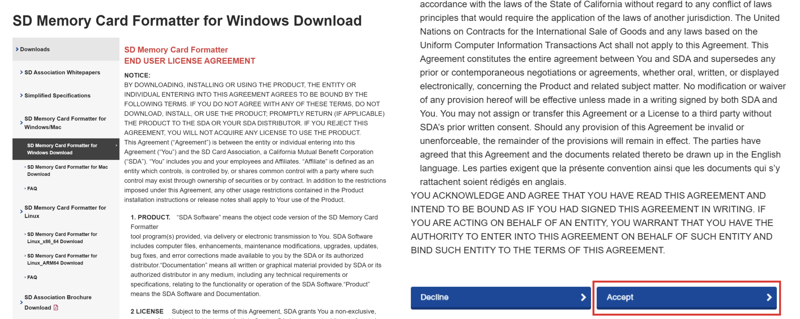
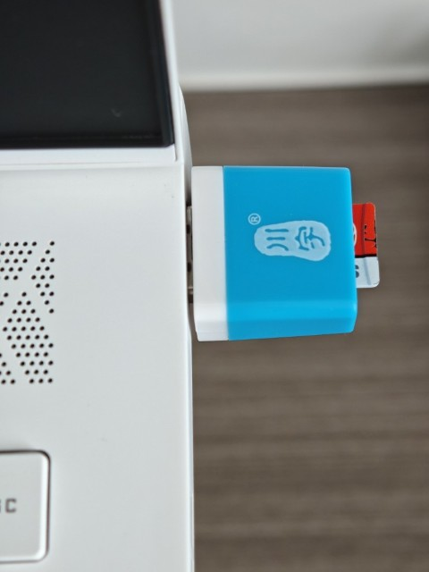
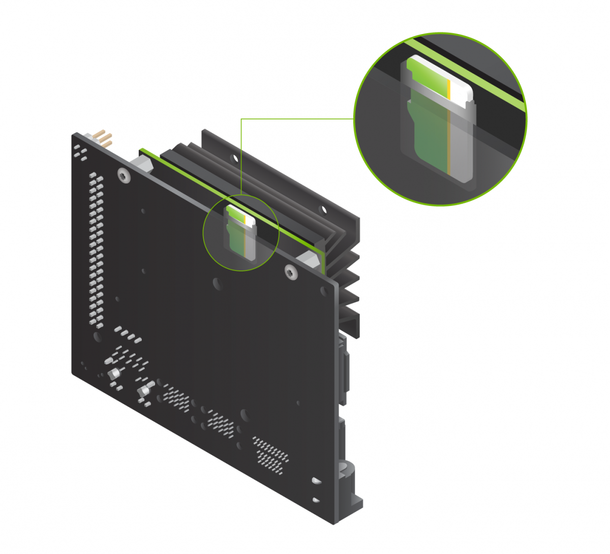

本指南中所使用的 Jetson 型号为 NVIDIA Jetson Nano (B01) 4GB，如图所示。

-4GB.png)

## 系统烧录

### 下载安装SD卡格式化工具 SD Card Formatter

SD Card Formatter 是由 SD 协会官方推出的一款专业开源工具。其界面简洁易用，提供稳定可靠的格式化功能，全面支持 FAT32、exFAT 和 NTFS 文件系统。该工具能够高效修复 SD 卡中潜在的错误，保障数据安全，同时优化存储设备的读写性能。

以 Windows 系统为例，可以从 [SD Association](https://www.sdcard.org/downloads/formatter/sd-memory-card-formatter-for-windows-download/) 获取 SD Card Formatter 的最新版本。如图所示，打开网页后下拉到最底部，选择“Accept”后开始下载。



下载完成后得到 `SDCardFormatterv5_WinEN.zip` 压缩文件。解压后在 `SDCardFormatterv5_WinEN` 文件夹中运行名为 `SD Card Formatter 5.0.3 Setup EN.exe` 的安装程序，安装过程如图所示。

.png)

.png)

.png)

.png)

.png)

.png)

.png)

.png)


### 下载安装系统镜像烧录软件 balenaEtcher

BalenaEtcher 是一款免费开源的跨平台镜像烧录工具，专为快速、安全地将操作系统镜像写入 USB 驱动器、SD 卡等可移动设备而设计。该工具拥有直观的三步操作流程，支持 Windows、macOS 和 Linux 三大操作系统，是烧录系统镜像的优选工具。

以 Windows 系统为例，可以从 [balenaEtcher](https://etcher.balena.io/) 获取最新版本，如图所示。

.png)

.png)

balenaEtcher 的安装过程为无界面式设计。用户只需双击运行下载的 .exe 可执行文件，桌面即会出现一个如图所示的 balenaEtcher 图标窗口，期间软件将自动完成安装与配置，并在准备就绪后直接启动主程序。


### 烧录系统镜像

1. 下载 SD 卡镜像文件

   下载 [Jetson Nano 开发者套件 SD 卡镜像文件](https://developer.nvidia.com/jetson-nano-sd-card-image)，并记下其在电脑中的保存位置。

2. 格式化 SD 卡

   将 microSD 卡插入到 SD 卡读卡器中，然后把读卡器连接至电脑，如图所示。

   

   运行 SD Card Formatter，如图所示。

   .png)

   选择需要格式化的 SD 卡，之后选择“Quick Format”，将“Volume label”留空，点击“Format”开始格式化，并在弹出的警告对话框中选择“是”，如图所示。

   .png)

   .png)

   .png)


   等待格式化完毕后，在弹出的对话框中选择“确定”，如图所示。

   .png)

   .png)

3. 将镜像写入 SD 卡

   以管理员身份运行 balenaEtcher，如图所示。

   .png)

   点击“从文件烧录”并选择之前下载的镜像文件。

   .png)

   .png)


   点击“选择目标磁盘”，选择格式化后的 SD 卡并点击“选定”。

   .png)

   .png)

   .png)

   .png)


   点击“现在烧录！”，开始写入镜像。

   .png)

   .png)

   .png)

   .png)


   此时 SD 卡已准备就绪。Windows 系统可能会提示无法读取 SD 卡，属于正常现象。

## 配置 Jetson 系统

### 首次启动前准备

1. 准备一个 microSD 储存卡，并烧录好系统。

2. 将 SD 卡插入 Jetson Nano 的 SD 卡插槽中，如图所示。

   

3. 用 HDMI 接口连接 Jetson Nano 和显示器，用 USB 接口连接键盘与鼠标。

4. 在 DC 接口处连接直流电源。

### 首次启动系统

连接电源后，Jetson Nano会立即启动。首先将显示如图所示的 NIVIDIA 图标，之后经历如图所示的一系列自检等过程，直到启动如图所示的系统设置窗口。

.png)

.png)

.png)

勾选“I accept the terms of these licenses”，并点击“Continue”。

.png)

.png)

在语言设置中，下拉到底部，找到并选择“中文(简体)”，然后点击“继续”。

.png)

.png)

在键盘布局设置中保持默认设置，点击“继续”。

.png)

在无线网络设置中，选择“连接到这个网络”，找到并选择自己的 Wi-Fi，点击“连接”。

.png)

.png)

在弹出的窗口中输入 Wi-Fi 密码，点击“Connect”，稍等连接完毕后，点击“继续”。

.png)

.png)

.png)

地区设置保持为默认“Shanghai”，并点击“继续”。

.png)

在用户设置页面，依次设置姓名、主机名、用户名、密码，并选择“自动登录”。设置完毕后，点击“继续”。

.png)

.png)

在 APP 分区大小设置中，保持其为默认设置（即 `Maximum accepted size` 的大小），点击“继续”。

.png)

在功率模式设置中，保持默认设置，点击“继续”。

.png)

稍后系统会自动完成设置，如图所示。

.png)

自动设置完毕后进入桌面，显示如图界面。

.png)

首次启动后，建议运行 `sudo reboot` 命令重启 Jetson Nano，重新进入系统后看到如图所示桌面。

.png)

自此，首次启动过程完成。

### 系统本地化设置

1. apt 软件源设置

   由于默认 apt 软件源的服务器在国外，下载速度缓慢，于是使用清华大学开源软件镜像站提供的 Ubuntu Ports 软件仓库替换系统默认的 apt 软件源。

   首先打开 Terminal，将原先的 apt 软件源备份。

   ```bash title="Terminal" frame="terminal"
   sudo cp /etc/apt/sources.list /etc/apt/sources.list.bak
   ```

   之后使用如下命令，修改 apt 软件源。

   ```bash title="Configure APT Sources" frame="terminal"
   sudo tee /etc/apt/sources.list <<-'EOF'
   deb https://mirrors.tuna.tsinghua.edu.cn/ubuntu-ports/ bionic main restricted universe multiverse
   deb https://mirrors.tuna.tsinghua.edu.cn/ubuntu-ports/ bionic-updates main restricted universe multiverse
   deb https://mirrors.tuna.tsinghua.edu.cn/ubuntu-ports/ bionic-backports main restricted universe multiverse
   deb http://ports.ubuntu.com/ubuntu-ports/ bionic-security main restricted universe multiverse
   EOF
   ```

   最后运行“sudo apt update”以应用更改。

2. 系统语言设置

   虽然在首次启动系统时已经修改了系统语言，但是系统大部分界面仍为英文。我们可以通过 Ubuntu 提供的图形化界面修改系统语言为中文。

   双击左侧任务栏中的“System Settings”，打开系统设置页面。

   .png)

   点击“Language Support”，打开语言支持。

   .png)

   在语言支持界面中提示“语言支持没有安装完整”，点击“安装”。

   .png)

   输入用户密码，点击“Authenticate”，等待语言支持安装完毕后，点击“Close”关闭窗口。

   .png)

   .png)

   .png)

   重启系统后，可以看到系统界面已全部变为中文。

   .png)

## 安装并配置 Docker 容器

### 安装 Docker

首先运行升级所有系统软件包。

```bash title="Terminal" frame="terminal"
sudo apt update && sudo apt upgrade -y
```

由于 Jetson Nano 开发者套件中已默认安装好 Docker，可以通过以下命令验证 Docker 是否成功安装并更新到最新版本。

```bash title="Terminal" frame="terminal"
sudo docker version
```

### 使用国内镜像加速 Docker

运行如下命令，添加国内镜像，并重启 Docker 服务。

```bash title="Configure Docker Mirrors" frame="terminal"
sudo mkdir -p /etc/docker

sudo tee /etc/docker/daemon.json <<-'EOF'
{
    "registry-mirrors": [
        "https://docker.1ms.run",
        "https://dockercf.jsdelivr.fyi/",
        "https://docker.m.daocloud.io"
    ]
}
EOF

sudo systemctl daemon-reload
sudo systemctl restart docker
```

### 将当前用户加入 docker 用户组

在使用 docker 命令前，每次都需要添加“sudo”前缀。通过将当前用户加入 docker 用户组，可以让当前用户直接运行 docker 命令。

首先创建 docker 用户组。通常在安装 Docker 时，docker 用户组会自动创建，但也可以运行以下命令来创建或确认：

```bash title="Terminal" frame="terminal"
sudo groupadd docker
```

如果已存在 docker 用户组则会提示：groupadd：“docker”组已存在。

然后将当前用户添加到 docker 用户组中。

```bash title="Terminal" frame="terminal"
sudo usermod -aG docker $USER

# 也可以使用下面的命令
# sudo usermod -aG docker $(whoami)
```

注销并重新登录当前用户后生效。

### 验证 Docker 的安装与配置

运行如下命令。

```bash title="Terminal" frame="terminal"
sudo docker run --rm hello-world
```

终端中输出如下信息，说明 Docker 的安装与配置过程完成。

```shellsession title="Docker Output" frame="terminal"
Unable to find image 'hello-world:latest' locally
latest: Pulling from library/hello-world
198f93fd5094: Pull complete 
Digest: sha256:a0dfb02aac212703bfcb339d77d47ec32c8706ff250850ecc0e19c8737b18567
Status: Downloaded newer image for hello-world:latest

Hello from Docker!
This message shows that your installation appears to be working correctly.

To generate this message, Docker took the following steps:
 1. The Docker client contacted the Docker daemon.
 2. The Docker daemon pulled the "hello-world" image from the Docker Hub.
    (arm64v8)
 3. The Docker daemon created a new container from that image which runs the
    executable that produces the output you are currently reading.
 4. The Docker daemon streamed that output to the Docker client, which sent it
    to your terminal.

To try something more ambitious, you can run an Ubuntu container with:
 $ docker run -it ubuntu bash

Share images, automate workflows, and more with a free Docker ID:
 https://hub.docker.com/

For more examples and ideas, visit:
 https://docs.docker.com/get-started/
```

## 在容器中安装 YOLO

### 配置 NVIDIA 运行时

运行 YOLO11 需要 NVIDIA 运行时，而 Docker 内默认不含 NVIDIA 运行时，需要额外配置。

运行如下命令，编辑或创建 Docker 的配置文件（以下配置文件包含镜像和 NIVIDIA 运行时）。

```bash title="Configure NVIDIA Runtime" frame="terminal"
sudo mkdir -p /etc/docker
sudo tee /etc/docker/daemon.json <<-'EOF'
{
    "registry-mirrors": [
        "https://docker.1ms.run",
        "https://dockercf.jsdelivr.fyi/",
        "https://docker.m.daocloud.io"
    ],
    "runtimes": {
        "nvidia": {
            "path": "nvidia-container-runtime",
            "runtimeArgs": []
        }
    },
	"default-runtime": "nvidia"
}
EOF
```

重启 Docker 服务以应用编辑好的配置。

```bash title="Terminal" frame="terminal"
sudo systemctl daemon-reload
sudo systemctl restart docker
```

### 安装 YOLO11

本项目所使用的 NVIDIA Jetson Nano (B01) 4GB 仅支持 JetPack 4。查阅 [快速入门指南：Ultralytics YOLO11 与 NVIDIA Jetson](https://docs.ultralytics.com/zh/guides/nvidia-jetson/#jetpack-support-based-on-jetson-device) 可以得知，可以直接运行如下命令以安装 YOLO11。

```bash title="Terminal" frame="terminal"
t=ultralytics/ultralytics:latest-jetson-jetpack4
sudo docker pull $t && sudo docker run -it --ipc=host --runtime=nvidia $t
```

等待安装完成后，自动进入 Docker 命令行，运行如下命令验证 YOLO 的安装。

```bash title="Terminal" frame="terminal"
python3 -c "import torch; print(f'PyTorch CUDA available: {torch.cuda.is_available()}')"
```

若提示 `PyTorch CUDA available: True`，说明 YOLO 已成功安装。

为了便于使用，也可以用 `docker ps -a` 查阅容器名称，并重命名容器。
