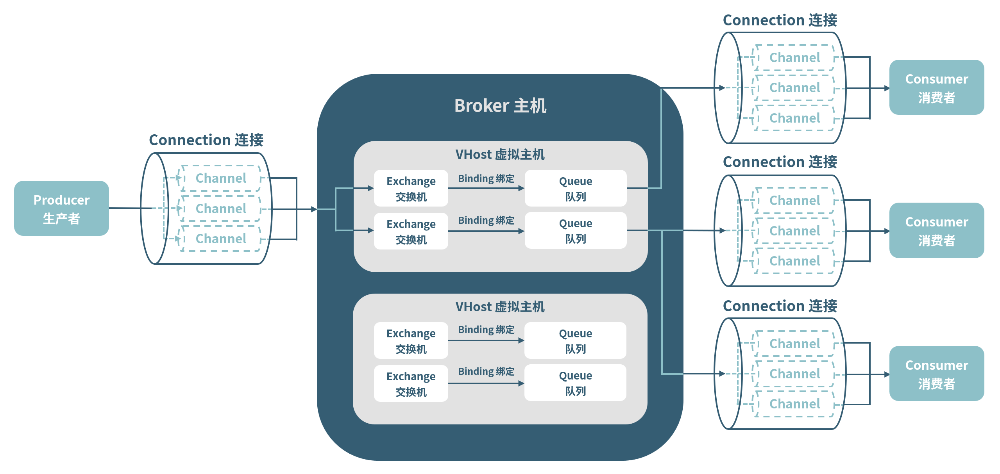
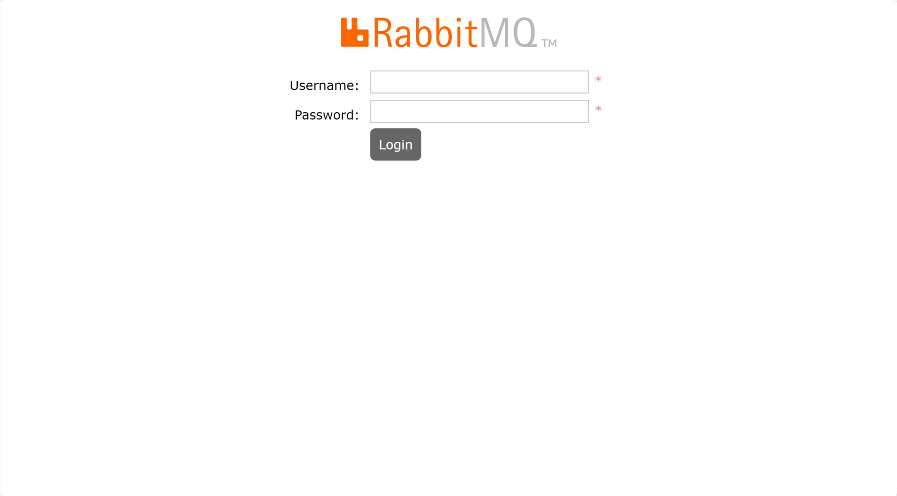
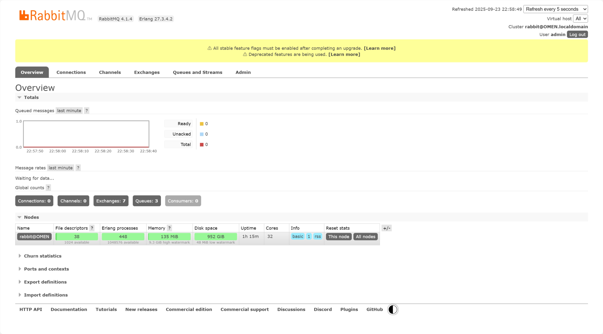
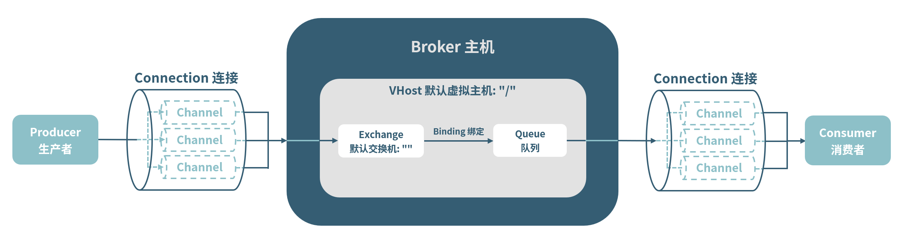
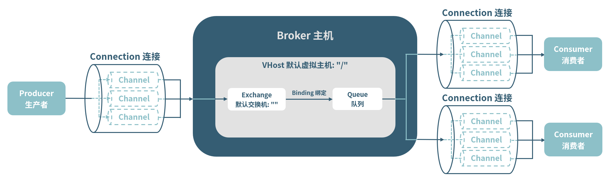
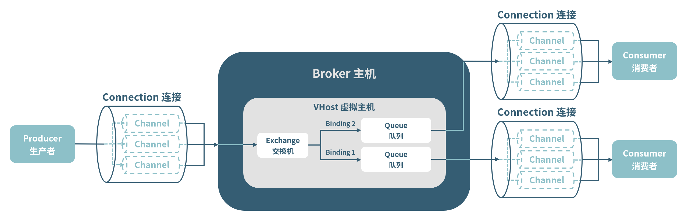
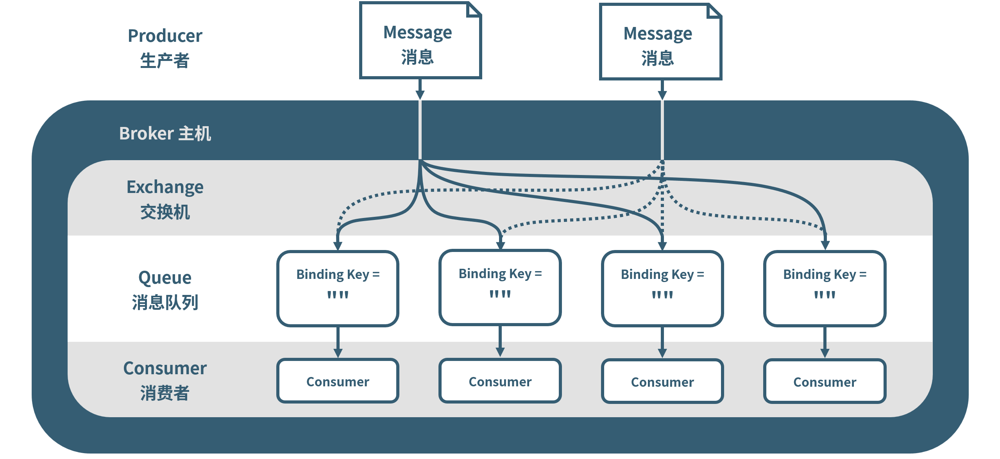
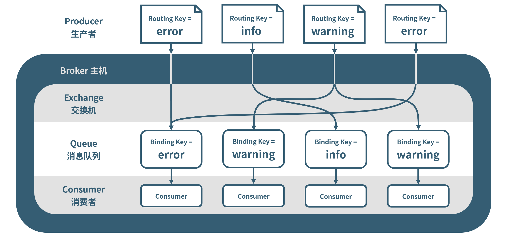
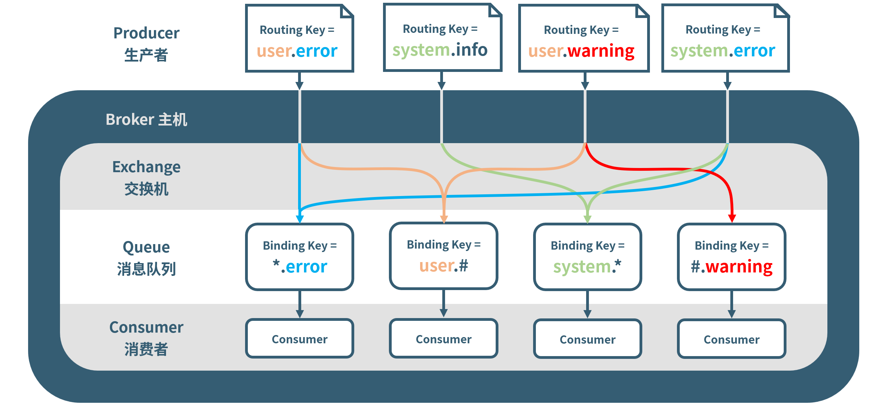

## RabbitMQ 简介

RabbitMQ 是一个由 Erlang 语言开发的 AMQP（一种消息队列协议）的开源实现。

RabbitMQ 主要用于两个及以上应用程序之间的相互通信。简单来说，**RabbitMQ 可以连接在任意位置的任意程序**。应用程序可以使用不同的编程语言实现，可以运行在不同设备上，可以运行在非局域网环境下……只要连接到同一个 RabbitMQ 服务器（至少一个运行了 RabbitMQ 程序的设备），就可以按照用户预设的方式传递消息。

### 为什么要使用消息队列

1. 解耦合：程序只需将消息发送到队列，无需关心哪个程序处理或何时处理。这种设计使得系统组件可以独立开发部署且易于扩展。
2. 异步处理：程序发送消息后无需等待消息被处理，可以继续执行其他任务，提高了系统的响应速度和吞吐量。
3. 流量削峰：消息队列可以作为缓冲区，暂存突发的大量请求，避免后端服务因瞬时压力过大而崩溃。

### 消息队列的基本应用场景

- **单 $\to$ 单**：即从一个应用程序发送到另一个应用程序，如订单处理程序和库存处理程序。用户下单后，订单处理程序生成一个“扣减库存”消息放入队列，库存服务从队列中取出消息并进行处理。
- **单 $\to$ 多**：即从一个应用程序发送到多个应用程序，如新闻推送程序（将同一个新闻发送到多个客户端中）或订单分发系统（将订单分发到不同的客户端中，且同一个订单不会被多个客户端接收）。
- **多 $\to$ 单**：即从多个应用程序发送到一个应用程序，如多个应用程序将产生的日志发送到统一的日志处理程序中。
- **多 $\to$ 多**：即从多个应用程序发送到其他多个应用程序，如物联网中枢。

运用消息队列时，一个发送消息的程序只需要将消息发送到某个消息队列，而无需了解其他发送消息的程序或者接收消息的程序；而多个程序发送消息时，对于消息队列本身来说，相当于同一个程序先后发送不同的消息。于是 **多个应用程序发送消息的情况可以视作单个应用程序发送多条消息**，即 **只需要考虑单 $\to$ 单和单 $\to$ 多两种情况**。

而在单 $\to$ 多的情况下，也有两种模式：第一种是每个接收消息的程序获得相同的消息，第二种是每个接收消息的程序获得不同的消息。前者就如之前提到的新闻推送程序，将同一个新闻发送到多个客户端中；后者就如订单分发系统，将订单分发到不同的客户端中，且需要保证同一个订单不会被多个客户端接收。

总而言之，运用消息队列时，有三种典型的应用场景：**单 $\to$ 单、单 $\to$ 多（接收的消息相同）和单 $\to$ 多（接收的消息不同）**。针对这三种应用场景，RabbitMQ 有着与之对应的三种模式：**简单模式、工作模式与交换机模式**。

## RabbitMQ 的抽象结构

RabbitMQ 的抽象结构如下图。



- **消息（Message）**：由消息头（properties）和消息体（body）组成。
  - 消息头包含了消息的一系列可选属性，包括路由键 `routing key`、可持久化标签 `delivery mode`、优先级 `priority` 等。
  - 消息体可以是任何被表示为二进制序列的数据，对于 RabbitMQ 是不透明的。RabbitMQ 不会检查和审核消息体的内容。
- **生产者（Producer）**：一个发送消息的应用程序。
- **消费者（Consumer）**：一个从消息队列中接收消息的应用程序。
- **连接（Connection）**：网络连接，比如一个 TCP 连接。
- **信道（Channel）**：Connection 中的一条双向数据流通道。Channel 是建立在真实的 TCP 连接内的虚拟连接，不管是发布消息、订阅队列还是接收消息，都需要通过 Channel 完成。多线程程序会经常建立和销毁 TCP 连接，产生极大的开销，于是引入了 Channel 以复用一条 TCP 连接。
- **物理主机（Broker）**：一个 RabbitMQ 服务器实体，即一个运行了 RabbitMQ 程序的设备。使用 RabbitMQ 时，Producer 和 Consumer 无需安装 RabbitMQ，RabbitMQ 程序只在 Broker 上真正运行着。
- **交换机（Exchange）**：一个从 Producer 接收消息，并将消息发送到指定队列（由交换机自身类型和 Binding 决定）的对象。
- **队列（ Queue ）**：由 Producer （非交换机模式下）或 Consumer （交换机模式下）建立的消息存储容器。
  - Queue 容器的大小默认是无限的，只受到系统资源（内存、磁盘大小）的限制。
  - 当一个 Consumer 接收 Queue 中的一条消息并确认后，该消息才会被销毁。
  - 一个 Queue 中的一条消息只会被发送给一个 Consumer。如果需要将同一条消息发送给多个消费者，则需要 Exchange 将消息发送到每个消费者连接的 Queue 中。
- **绑定（Binding）**：一个决定 Queue 接收哪些消息的键值。
  - 一个 Queue 与默认交换机绑定时的 Binding 是其名称。
  - 只有当消息的 routing key 与 Queue 的 Binding 相同时，该消息才能进入该 Queue 中。
- **虚拟主机（ Virtual Host / VHost）**：表示一组 Exchange、Queue 和相应的 Binding。
  - 每一个 VHost 等价于一个小型的 RabbitMQ 服务器。
  - 每一个 RabbitMQ Broker 都有一个默认的 VHost “/”。
  - 在 RabbitMQ 中，用户只能以 VHost 为单位进行权限控制（例如，如果需要禁止 A 组访问 B 组的 Exchange、Queue 或者 Binding，必须为 A 和 B 分别创建一个虚拟主机）。

## 配置 RabbitMQ 服务器

RabbitMQ Broker 是唯一需要安装 RabbitMQ 服务的设备。无论是生产者还是消费者均无需安装 RabbitMQ。

### 安装并启动 RabbitMQ

RabbitMQ 是使用 Erlang 语言开发的，在安装前必须先安装和配置 Erlang 环境。具体可以查阅：[Installing RabbitMQ | RabbitMQ](https://www.rabbitmq.com/docs/download)。

由于 Windows 系统下 Erlang 的安装与配置较为繁琐，在此以 Ubuntu 24.04 为例。可以将 RabbitMQ 安装在 Docker 中，也可以直接安装在主机环境中。

> [!NOTE]
>
> 此部分更新于 2026/03/04，RabbitMQ 的最新版本为 4.2.4。

#### 方法一：在 Docker 中安装并启动 RabbbitMQ

##### 1 安装并配置 Docker

若主机中尚未安装 Docker，需要先安装 Docker。同时，为了解决传统模式下每次启动容器时，运行 `docker run` 需要记住大量参数和命令的问题，使用 Docker Compose 简化 Docker 容器的管理和部署。

###### 1.1 安装  Docker 及 Docker Compose

以下操作需要以 root 用户身份完成，请使用 `sudo -i` 或 `su root` 切换到 root 用户。

首先，运行以下命令，安装一些必要的软件包：

```bash
sudo apt update && sudo apt upgrade -y
sudo apt install curl vim wget gnupg dpkg apt-transport-https lsb-release ca-certificates
```

然后加入 Docker 的 GPG 公钥和 apt 源：

```bash
curl -sSL https://download.docker.com/linux/debian/gpg | gpg --dearmor > /usr/share/keyrings/docker-ce.gpg
echo "deb [arch=$(dpkg --print-architecture) signed-by=/usr/share/keyrings/docker-ce.gpg] https://download.docker.com/linux/debian $(lsb_release -sc) stable" > /etc/apt/sources.list.d/docker.list
```

> [!TIP]
>
> 如遇到网络问题，可以用 [清华大学开源软件镜像站 | Tsinghua Open Source Mirror](https://mirrors.tuna.tsinghua.edu.cn/) 的镜像源：
>
> ```bash
> curl -sSL https://download.docker.com/linux/debian/gpg | gpg --dearmor > /usr/share/keyrings/docker-ce.gpg
> echo "deb [arch=$(dpkg --print-architecture) signed-by=/usr/share/keyrings/docker-ce.gpg] https://mirrors.tuna.tsinghua.edu.cn/docker-ce/linux/debian $(lsb_release -sc) stable" > /etc/apt/sources.list.d/docker.list
> ```

之后可以直接安装 Docker 和 Docker Compose 了：

```bash
apt update && apt install docker-ce docker-ce-cli containerd.io docker-compose-plugin
```

Docker Compose 可以作为 Docker 插件 `docker-compose-plugin` 安装，也能以 `docker-compose` 软件包单独安装，二者区别如下：

|        安装方式         | 兼容性 |     启动命令     |
| :---------------------: | :----: | :--------------: |
| `docker-compose-plugin` |  较好  | `docker compose` |
|    `docker-compose`     |  最好  | `docker-compose` |

这里以 Docker 插件 `docker-compose-plugin` 的形式安装。如遇到兼容性问题，则可以单独安装 Docker Compose。

###### 1.2 验证安装

可以通过以下命令验证 Docker 和 Docker Compose 是否成功安装并已是最新版本。

```bash
sudo docker version
sudo docker compose version
```

###### 1.3 （可选）使用国内镜像加速 Docker

可以运行如下命令，添加国内镜像，并重启 Docker 服务。

```bash
sudo mkdir -p /etc/docker

sudo tee /etc/docker/daemon.json <<-'EOF'
{
    "registry-mirrors": [
        "https://docker.1ms.run",
        "https://dockercf.jsdelivr.fyi/",
        "https://docker.m.daocloud.io"
    ]
}
EOF

sudo systemctl daemon-reload
sudo systemctl restart docker
```

###### 1.4 将当前用户加入 docker 用户组

在使用 docker 命令前，每次都需要添加 `sudo` 前缀。通过将当前用户加入 docker 用户组，可以让当前用户直接运行 docker 命令。

首先创建 docker 用户组。通常在安装 Docker 时，docker 用户组会自动创建，但也可以运行以下命令来创建或确认：

```bash
sudo groupadd docker
```

如果已存在 docker 用户组则会提示：`groupadd：“docker”组已存在`。

然后将当前用户添加到 docker 用户组中。

```bash
sudo usermod -aG docker $USER

# 也可以使用下面的命令
# sudo usermod -aG docker $(whoami)
```

注销并重新登录当前用户，或使用 `newgrp docker` 刷新 docker 用户组权限后生效。

##### 2 在 Docker 中部署并启动 RabbitMQ

由于容器默认是非持久化的，需要先准备好持久化时所需的目录、文件及其权限，然后将 RabbitMQ 容器挂载在对应目录下。

下面以安装在用户目录 `~/Documents/docker/rabbitmq/` 下为例。运行：

```bash
mkdir -p ~/Documents/docker/rabbitmq/{data,config,logs}
cd ~/Document/docker/rabbitmq
touch ./config/rabbitmq.conf
sudo chown -R 999:999 ./data ./logs
```

然后创建 Docker Compose 配置文件：

```bash
tee ~/Documents/docker/rabbitmq/docker-compose.yml << 'EOF'
services:
  rabbitmq:
     # 镜像名
    image: rabbitmq:4-management
    # 容器名
    container_name: rabbitmq
    # 主机名
    hostname: rabbitmq-server
    # 重启策略
    restart: unless-stopped
    # 端口映射
    ports:
      - "5672:5672"      # AMQP 协议端口
      - "15672:15672"    # 管理界面 Web 端口
    # 环境变量
    environment:
      # 默认用户配置
      - RABBITMQ_DEFAULT_USER=admin
      - RABBITMQ_DEFAULT_PASS=admin
      # Erlang cookie
      - RABBITMQ_ERLANG_COOKIE=secret_cookie_debian
      # 日志位置
      - RABBITMQ_LOGS=/var/log/rabbitmq/rabbitmq.log
      - RABBITMQ_SASL_LOGS=/var/log/rabbitmq/rabbitmq-sasl.log
    # 卷挂载
    volumes:
      # 数据持久化
      - ./data:/var/lib/rabbitmq
      # 日志持久化
      - ./logs:/var/log/rabbitmq
      # 自定义配置文件
      - ./config/rabbitmq.conf:/etc/rabbitmq/rabbitmq.conf
    # 容器间通信网络
    networks:
      - rabbitmq-network

networks:
  rabbitmq-network:
    name: rabbitmq-network
    driver: bridge
EOF
```

然后运行如下命令，部署并启动 RabbitMQ：

```bash
docker compose up -d
```

现在，RabbitMQ 服务器会在系统启动时自动启动。

> [!WARNING]
>
> RabbitMQ 服务器默认的用户名为 `guest` ，密码也为 `guest`。但默认的 `guest` 用户只允许本地连接，如果需要远程连接和管理 Broker，需要创建一个管理员用户。
>
> 在先前的 `docker-compose.yml` 中，已经定义好默认的管理员用户名为 `admin`，密码也为 `admin`，可以直接使用，但请注意，如果要将 RabbitMQ 服务器暴露在公网中，请务必修改用户名和密码。

##### 3 通过命令行与 RabbitMQ 服务器交互

如果想通过命令行与 RabbitMQ 服务器交互，请使用如下命令：

```bash
docker exec -it rabbitmq bash
```

然后，就可以像在主机环境中一样，使用命令管理 RabbitMQ 服务器了。

> [!TIP]
>
> 由于容器中默认以 root 用户登录，因此若以此方式安装 RabbitMQ，在管理服务器时，命令前无需添加 `sudo`。

#### 方法二：在主机环境中安装并启动 RabbbitMQ

##### 1 安装 RabbitMQ

若要安装在主机环境中，可以使用官网 [Installing on Debian and Ubuntu | RabbitMQ](https://www.rabbitmq.com/docs/install-debian#apt-quick-start) 中提供的自动脚本。

```sh
#!/bin/sh

sudo apt-get install curl gnupg apt-transport-https -y

## Team RabbitMQ's signing key
curl -1sLf "https://keys.openpgp.org/vks/v1/by-fingerprint/0A9AF2115F4687BD29803A206B73A36E6026DFCA" | sudo gpg --dearmor | sudo tee /usr/share/keyrings/com.rabbitmq.team.gpg > /dev/null

## Add apt repositories maintained by Team RabbitMQ
sudo tee /etc/apt/sources.list.d/rabbitmq.list <<EOF
## Modern Erlang/OTP releases
##
deb [arch=amd64 signed-by=/usr/share/keyrings/com.rabbitmq.team.gpg] https://deb1.rabbitmq.com/rabbitmq-erlang/ubuntu/noble noble main
deb [arch=amd64 signed-by=/usr/share/keyrings/com.rabbitmq.team.gpg] https://deb2.rabbitmq.com/rabbitmq-erlang/ubuntu/noble noble main

## Latest RabbitMQ releases
##
deb [arch=amd64 signed-by=/usr/share/keyrings/com.rabbitmq.team.gpg] https://deb1.rabbitmq.com/rabbitmq-server/ubuntu/noble noble main
deb [arch=amd64 signed-by=/usr/share/keyrings/com.rabbitmq.team.gpg] https://deb2.rabbitmq.com/rabbitmq-server/ubuntu/noble noble main
EOF

## Update package indices
sudo apt-get update -y

## Install Erlang packages
sudo apt-get install -y erlang-base \
                        erlang-asn1 erlang-crypto erlang-eldap erlang-ftp erlang-inets \
                        erlang-mnesia erlang-os-mon erlang-parsetools erlang-public-key \
                        erlang-runtime-tools erlang-snmp erlang-ssl \
                        erlang-syntax-tools erlang-tftp erlang-tools erlang-xmerl

## Install rabbitmq-server and its dependencies
sudo apt-get install rabbitmq-server -y --fix-missing
```

##### 2 启动 RabbitMQ 服务器

若选择安装在主机环境内，RabbitMQ 将被安装在 `/usr/sbin/` 目录下。

由于该目录中包含系统管理命令，因此普通用户的 `PATH` 环境变量中默认不会包含该目录。要启动 RabbitMQ，或使用 RabbitMQ 安装目录的完整路径，或将 `/usr/sbin/` 目录加入当前用户的 `PATH` 中，或临时切换为 root 用户。

###### 方法一：使用完整路径

每次启动 RabbitMQ 服务器时，加上完整路径：

```bash
sudo /usr/sbin/rabbitmq-server
```

###### 方法二：临时切换为 root 用户

首先运行 `sudo -i` 或 `su root` 命令，临时切换为 root 用户，然后使用如下的命令启动 RabbitMQ 服务器：

```bash
rabbitmq-server
```

###### 方法三：将安装目录加入环境变量（推荐）

运行以下命令，将 `/usr/sbin/` 目录加入当前用户的 `PATH` 中。

```bash
export PATH=$PATH:/usr/sbin
source ~/.bashrc
```

然后，可以使用如下的命令启动 RabbitMQ 服务器：

```bash
sudo rabbitmq-server
```

以下均假设已按照方法三，将 `/usr/sbin/` 目录加入当前用户的 `PATH` 中。

##### 3 创建 RabbitMQ 服务器用户

在开始使用前，需要先创建一个用于访问 RabbitMQ 服务器的用户。

RabbitMQ 服务器默认的用户名为 `guest` ，密码也为 `guest`，但默认的 `guest` 用户只允许本地连接，如果需要远程连接和管理 Broker，需要创建一个管理员用户。

可以使用如下命令创建用户。

```bash
# 如果 RabbitMQ 还未启动，运行以下命令以启动服务
sudo systemctl start rabbitmq

user_name="admin"		# 新用户名
user_password="admin"	# 新用户密码
sudo rabbitmqctl add_user "$user_name" "$user_password"		# 添加用户
sudo rabbitmqctl set_user_tags "$user_name" administrator	# 设置用户为管理员

# （可选）为该用户设置访问默认虚拟主机“/”的权限
sudo rabbitmqctl set_permissions -p / "$user_name" ".*" ".*" ".*"
# （可选，在生产环境下推荐）删除默认的 guest 用户
sudo rabbitmqctl delete_user guest
```

### 配置 RabbitMQ 服务器

如果安装在主机环境中，RabbitMQ 的配置文件路径位于 `/etc/rabbitmq/rabbitmq.conf`。

如果安装在 Docker 中，RabbitMQ 的配置文件位于安装目录中的 `config/rabbitmq.conf`，请在非容器环境（主机环境）下进行修改。

关于 RabbitMQ 配置文件的参数，可以参考 [Configuration | RabbitMQ](https://www.rabbitmq.com/docs/configure#config-items)。以下是一些常见的参数。

```text
listeners.tcp.default = 5672	# 监听端口，默认为 5672
disk_free_limit.absolute = 50MB	# 磁盘空闲空间限制绝对大小，低于该值时 RabbitMQ 将阻止消息的写入，默认为 50MB
disk_free_limit.relative = 1.5	# 磁盘空闲空间限制相对于内存的大小
vm_memory_high_watermark.absolute = 2GB		# Broker 能占用的最大内存绝对大小
vm_memory_high_watermark.relative = 0.6		# Broker 能占用的最大内存相对大小，默认为 0.6
```

之前我们提到：

> Queue 容器的大小默认是无限的，只受到系统资源（内存、磁盘大小）的限制。

Queue 的大小其实就是受到 `disk_free_limit`、`vm_memory_high_watermark` 等参数的限制。

### （可选）创建虚拟主机

RabbitMQ 的默认虚拟主机为 “/”。也可以使用以下命令自行创建。

```bash
vhost="/vhost"		# 新 vhost 名
user="admin"		# 可以访问该 vhost 的用户名
sudo rabbitmqctl add_vhost "$vhost"		# 新建 vhost
sudo rabbitmqctl set_permissions -p "$vhost" "$user" ".*" ".*" ".*"	# 为用户设置可访问该 vhost 
```

### 管理 RabbitMQ 服务器

常用的管理命令如下。

```bash
sudo rabbitmqctl status				# 查看服务器状态
sudo rabbitmqctl list_exchanges		# 列出当前所有 exchange
sudo rabbitmqctl list_queues		# 列出当前所有 queue
sudo rabbitmqctl list_users			# 列出当前所有用户

sudo rabbitmqctl stop				# 关闭 RabbitMQ 服务器
```

也可以安装插件以通过网页 UI 管理 RabbitMQ 服务器。使用以下命令启用插件。

```bash
sudo rabbitmq-plugins enable rabbitmq_management
```

然后重启 RabbitMQ 服务器。

```bash
sudo rabbitmqctl stop
sudo rabbitmq-server
```

通过访问 `https://<server-ip>:15672`（将 `<server-ip>` 替换为服务器公网 IP 或 `localhost`）并使用具有远程访问权限的管理员账户登录，即可进入 RabbitMQ 管理界面，如图所示。





自此，RabbitMQ 服务器的配置已全部完成。

## RabbitMQ 的使用

RabbitMQ 服务器可以通过任何支持 AMQP 协议的语言连接，只要引入对应的库即可。对于 Python 而言，需要引入 `pika` 库；对于 Java 而言，需要使用 `amqp-client` 库；对于 Node.js 而言，是 `amqplib` 库；对于 Go 而言，是 `streadway/amqp` 库……

此处以 Python 为例。在生产者和消费者程序的开头，需要先导入 `pika` 库。

```python
import pika
```

先前，我们已经提到过使用 RabbitMQ 的三种模式。

> 运用消息队列时，有三种典型的应用场景：**单 $\to$ 单、单 $\to$ 多（接收的消息相同）和单 $\to$ 多（接收的消息不同）**。针对这三种应用场景，RabbitMQ 有着与之对应的三种模式：**简单模式、工作模式与交换机模式**。

并且已经了解了 RabbitMQ 的基本抽象结构。

> 

为了使问题简化，我们一律只使用默认的虚拟主机 “/”，并且假设生产者、消费者和 RabbitMQ 服务器在同一设备上（即 RabbitMQ 服务器的地址为 `localhost` 或 `127.0.0.1`）。现在，让我们一一来看这三种模式。

### 简单模式

在简单模式下，是单 $\to$ 单的，一个生产者 Producer 产生的消息进入一个消息队列 Queue 后，将被直接发送给消费者 Consumer，因而不需要交换机 Exchange（因为 Exchange 用于将消息发送至多个队列）。于是我们只使用默认交换机 “”，并且无需设置 Binding。抽象结构如下图所示。



对于生产者而言，需要完成的步骤为：

1. 连接到 RabbitMQ 服务器
2. 新建一个队列
3. 发送消息到队列中

而对于消费者而言，需要完成的步骤为：

1. 连接到 RabbitMQ 服务器
2. 新建一个队列
3. 监听队列，接收消息

> [!TIP]
>
> **为什么生产者和消费者都要新建一个队列？**
>
> 因为无法确定生产者和消费者的运行顺序。若只在生产者中新建队列，则当消费者先运行时，无法连接待监听队列；反之，若只在消费者中新建队列，则当生产者先运行时，无法发送消息到队列中。

#### 生产者

简单模式下，一个完整的生产者程序示例如下。

```python
import pika

# 连接至RabbitMQ服务器
connection_params = pika.ConnectionParameters(host="localhost")
connection = pika.BlockingConnection(connection_params)
channel = connection.channel()

# 声明一个'hello'队列
queue_name = 'hello'
channel.queue_declare(queue=queue_name)

# 发送消息到'hello'队列
message = 'Hello World!'
channel.basic_publish(exchange='',
                      routing_key=queue_name,
                      body=message)

# 关闭连接
connection.close()
```

##### Step 1：连接 RabbitMQ 服务器

连接 RabbitMQ 服务器一般使用如下命令。

```python
# 设置连接参数
connection_params = pika.ConnectionParameters(host="localhost")

# 连接服务器
connection = pika.BlockingConnection(connection_params)
channel = connection.channel()
```

首先设置了连接参数 `connection_params` 为 `pika.ConnectionParameters(host = "localhost")`，表示连接本地主机 `localhost`。`ConnectionParameters()` 函数用于生成一个连接参数对象，一些常用参数的默认值如下。

- `host = "localhost"`：目标 RabbitMQ 服务器的主机名或 IP 地址
- `port = 5672`：用于 AMQP 协议通信的端口号
- `virtual_host = '/'`：连接的虚拟主机名称
- `credentials = None`：身份验证凭据。一般使用 `pika.PlainCredentials(username, password)`；如为 `None`，则默认使用用户名 `guest` 和密码 `guest`
- `heartbeat = 60`：心跳间隔。用于确保网络连接有效。设置为 0 将关闭心跳检测
- `connection_attempts = 1`
- 每次连接尝试之间等待的秒数：`retry_delay = 2.0`

 `pika.BlockingConnection(connection_params)` 表示使用 `connection_params` 参数，以阻塞方式连接 RabbitMQ 服务器。`BlockingConnection()` 函数表示以阻塞方式连接，这是最常用的连接方式。还有一些其他连接方式，如 `SelectConnection()`、`AsyncioConnection()` 等。

 `channel = connection.channel()` 用于获取信道 Channel 对象，后续新建队列、发送信息等都是通过信道对象进行的。

##### Step 2：新建队列

```python
# 将队列名称设置为 'hello'
queue_name = 'hello'

# 声明队列
channel.queue_declare(queue=queue_name)
```

使用 `queue_declare()` 方法可以新建一个队列，该方法至少传递一个参数 `queue`，即队列名称。除了直接使用 `queue` 参数指定队列名外，也可以将可选参数 `exclusive` 设置为 `True`，RabbitMQ 服务器将自动创建一个不会重名的队列，该队列可以通过 `.method.queue` 获取名称。使用 `exclusive` 参数的代码如下，这与上面给出的代码是等价的。

```python
# 新建队列，并使用 .method.queue 获取队列名
queue_created = channel.queue_declare("",exclusive=True)
queue_name = queue_created.method.queue
```

##### Step 3: 发送消息

```python
# 将待发送的消息体设置为 'Hello World!'
message = 'Hello World!'

# 发送消息
channel.basic_publish(exchange='',
                      routing_key=queue_name,
                      body=message)
```

使用 `basic_publish()` 方法可以将消息发送到指定队列。`basic_publish()` 方法至少接收三个参数，包括交换机名称 `exchange`、消息的路由键值 `routing_key` 和消息体 `body`。

**在简单模式下，使用默认交换机 `""`，并将 `routing_key` 设置为消息队列名称。**

> [!TIP]
>
> **为什么要把 `routing_key` 设置为消息队列名称？**
>
> 先前，在 Binding 的名词解释中，我们提到：
>
> > - 一个 Queue 与默认交换机绑定时的 Binding 是其名称。
> > - 只有当消息的 routing key 与 Queue 的 Binding 相同时，该消息才能进入该 Queue 中。
>
> 在这里，由于没有修改 Queue 的 Binding，所以消息的 `routing_key` 应设置为 Queue 默认的 Binding，即消息队列的名称。

##### Step 4: 关闭连接

```python
connection.close()
```

在生产者不必发送消息后，请养成良好的使用习惯，手动关闭连接。

#### 消费者

简单模式下，一个完整的消费者程序示例如下。

```python
import pika

# 连接至RabbitMQ服务器
connection_params = pika.ConnectionParameters(host="localhost")
connection = pika.BlockingConnection(connection_params)
channel = connection.channel()

# 声明一个'hello'队列
queue_name = 'hello'
channel.queue_declare(queue=queue_name)

# 以上部分消费者与生产者一致

# 定义callback函数，用于在收到消息后处理消息
def callback(ch, method, properties, body):
    print(" [x] Received %r" % body)

# 配置消费者：1.监听'hello'队列 2.收到消息后执行callback函数
channel.basic_consume(queue=queue_name,
                      auto_ack=True,    # 自动确认消息
                      on_message_callback=callback)

# 正式开始监听队列
channel.start_consuming()
```

##### Step 1：连接 RabbitMQ 服务器

同生产者中“连接 RabbitMQ 服务器”。

##### Step 2：新建队列

同生产者中“新建队列”。

##### Step 3：配置消费者

在开始监听队列、接收消息前，需要先配置好消费者。需要配置的项目包括需要监听的队列名称，以及收到消息后消费者的行为。

```python
# 定义callback函数，用于在收到消息后处理消息
# ch为channel对象，method为消息传递时用到的方法，properties为消息的属性，body为消息体
def callback(ch, method, properties, body):
    print(" [x] Received %r" % body)

# 配置消费者：1.监听'hello'队列 2.收到消息后执行callback函数
channel.basic_consume(queue='hello',
                      auto_ack=True,    # 自动确认消息
                      on_message_callback=callback)
```

这个程序片段首先定义了 `callback()` 函数，用于在收到消息后处理消息。`callback()` 函数后的参数列表 `ch`，`method`，`properties` 和 `body` 是固定的，分别代表连接中的 Channel 对象、消息传递时用到的方法、消息的属性和消息体。在这个片段中，`callback()` 函数只是简单地打印消息体的内容。

在定义了 `callback()` 函数后，需要使用 `basic_comsume()` 方法配置消费者（注意此时还没有开始监听队列）。`basic_comsume()` 方法至少接收两个参数，包括需要监听的队列名称 `queue` 和收到消息后消费者的行为 `on_message_callback`。

你可能注意到，在 `basic_comsume()` 方法中还有一个参数：`auto_ack`。这个可选参数用于设置消费者是否自动确认消息，默认为 `False`。关于自动 / 手动确认消息的内容在稍后会详细解释。

##### Step 4：正式监听队列并接收消息

```python
channel.start_consuming()
```

此时消费者会以阻塞方式持续监听 `hello` 队列，当一条消息进入 `hello` 队列中后，会被消费者立即接收。

#### 常用参数

##### 自动 / 手动确认消息

先前，消费者程序示例的 `basic_comsume()` 方法中出现了一个可选参数：`auto_ack`。之前我们提到：

> 当一个 Consumer 接收 Queue 中的一条消息并确认后，该消息才会被销毁。

`auto_ack` 便是用于配置消费者是否自动确认消息的。

当 `auto_ack` 设置为 `True` 时，消息在发送到消费者中后，会立即被确认，随后在 Queue 中被销毁。然而，有时因为特殊原因，消费者程序在接收到消息后异常退出（比如在 `callback()` 函数中出现语法错误），此时已发送到消费者程序中的消息将会永久丢失。若要在这种情况下不丢失消息，需要手动确认消息。

当 `auto_ack` 为 `False` 时，消费者需要在 `callback()` 函数中手动确认消息，如下所示。

```python
# 定义callback函数，用于在收到消息后处理消息
def callback(ch, method, properties, body):
    print(" [x] Received %r" % body)				# 打印消息体
    ch.basic_ack(delivery_tag=method.delivery_tag)  # 手动确认消息已被处理

# 配置消费者：1.监听'hello2'队列 2.收到消息后执行callback函数
channel.basic_consume(queue='hello',
                      auto_ack=False,    # 手动确认消息
                      on_message_callback=callback)
```

该程序片段只是在先前的消费者程序中改动了两点。

首先，将 `basic_consume()` 方法中的可选参数 `auto_ack` 设置为 `False` 。

然后，在 `callback()` 函数中添加 `ch.basic_ack(delivery_tag=method.delivery_tag)` 手动确认消息。

- `basic_ack()` 方法用于消费者确认消息。该方法接收两个可选参数：`delivery_tag` 和 `multiple`。

  - `delivery_tag` 参数用于指定消息的投递标签，默认值为 `0`。在同一个信道上，消息的投递标签按照时间顺序单调递增。通常使用 `method.delivery_tag` 获取消费者当前正处理的消息。
  
  - `multiple` 参数用于控制确认范围。默认值为 `False`，表示只确认 `delivery_tag` 指定的单条消息。若设置为 `True`，则会确认所有投递标签小于等于 `delivery_tag` 的尚未确认的消息。
  
- 除了使用 `basic_ack()` 方法确认消息外，还可以使用 `basic_nack()` 和 `basic_reject()` 拒绝消息。

  - `basic_nack()` 方法除了接收 `delivery_tag` 和 `multiple` 两个可选参数外，还接收一个可选参数 `requeue`。`requeue` 参数用于配置被拒绝的消息是否重新回到消息队列 Queue 中。默认值为 `True`，表示重新入队。

  - `basic_reject()` 方法相比 `basic_nack()` 方法只缺少一个可选参数 `multiple`，即接收 `delivery_tag` 和 `requeue`两个可选参数，不批量拒绝消息。


##### 可持久化

除了消费者程序异常退出以外，Broker 服务器关闭后消息也会永久丢失。若要防止丢失消息，需要以下步骤。

1. 创建队列时，设置消息队列 Queue 为可持久化队列。
2. 发布消息时，设置生产者发送的消息为持久化消息。

首先，在生产者和消费者程序中创建消息队列 Queue 时，设置消息队列为可持久化的，如下所示。

```python
# 在参数列表中添加 durable=True，以声明一个可持久化的'durable_queue'队列
channel.queue_declare(queue='durable_queue', durable=True)
```

`durable=True` 表示创建的队列是可持久化队列。注意：“可持久化队列”不是“持久化队列”，其中的消息有持久化的，也有非持久化的。可持久化队列在关闭后只会保留持久化消息。

然后，在生产者发送消息时，设置发送的消息为持久化消息，如下所示。

```python
# 在参数列表中添加 properties=pika.BasicProperties(delivery_mode=2)
# 发送持久化消息到'hello'队列
channel.basic_publish(exchange='',
                      routing_key='durable_queue',
                      body='Hello World!',
                      properties=pika.BasicProperties(delivery_mode=2))  # 标记消息为持久化
```

`properties` 参数为 `BasicProperties` 对象类型，通常使用 `pika.BasicProperties()` 生成一个 `BasicProperties` 对象。其中，`delivery_mode` 标记消息是否为持久化的，`1` 代表非持久化，`2` 代表持久化。

##### 优先级

RabbitMQ 也支持优先级消息队列。使用优先级消息队列，需要以下步骤。

1. 创建队列时，设置消息队列 Queue 中消息的最大优先级。
2. 发布消息时，在消息的属性中设置消息的优先级。

如果没有设置消息队列的最大优先级，那么即使在消息属性中设置了消息的优先级，消息的优先级也会被忽略。

首先，在生产者和消费者程序中创建消息队列 Queue 时，添加 `x-max-priority` 的参数，表示最大优先级。

```python
# 在参数列表中添加 'x-max-priority'，以声明一个'priority_queue'优先级队列
channel.queue_declare(
    queue='priority_queue',
    arguments={
        'x-max-priority': 10  #设置最大优先级
    }
)
```

`x-max-priority` 参数的范围在 `1` 到 `255` 之间，必须在队列声明时设置，且后续不能修改。

在生产者发送消息时，设置发送的消息为持久化消息，如下所示。

```python
ch.basic_publish(exchange='',
            	routing_key='priority_queue',
            	body='Hello World!',
            	properties=pika.BasicProperties(priority=5))	# 标记消息的优先级为 5
```

`priority` 属性参数的范围在 `0` 到 `x-max-priority` 之间。`priority` 的数值越大，优先级越高。当消息的 `priority` 属性大于消息队列的 `x-max-priority` 时，RabbitMQ 会将该消息的优先级截断为 `x-max-priority` 的最大值。

### 工作模式

在工作模式下，是单 $\to$ 多，一个生产者 Producer 产生的消息进入一个消息队列 Queue 后，将被发送给多个消费者 Consumer，同样不需要交换机 Exchange。于是我们只使用默认交换机 “”，并且无需设置 Binding。抽象结构如下图所示。



对于生产者 Producer 而言，需要完成的步骤不变。即：工作模式下，生产者程序的代码与简单模式下一致。

对于消费者 Consumer 而言，需要完成的步骤也不变，可以沿用简单模式下消费者程序的代码。但是由于同一个消息队列 Queue 连接了多个消费者，Queue 发送消息到消费者的顺序就变得十分重要了。下面会一一介绍几种不同的分发顺序。

#### 轮询分发

若直接运行简单模式下消费者程序的代码，RabbitMQ 会采用轮询分发模式，按照消费者连接到 Broker 的先后顺序，依次将消息发送给各个消费者，并且只有在当前消息被确认后，才会向下一个消费者发送下一条消息。

例如，假设有两个消费者 `C1` 和 `C2`，且消费者 `C1` 先于消费者 `C2` 连接至 Broker。当 Queue 中存在两条消息 `M1` 和 `M2` 时，`M1` 会先被发送给 `C1`；只有在收到 `C1` 对 `M1` 的确认后，`M2` 才会被发送给 `C2`。

然而，在默认的轮询分发模式下，若一个消费者处理消息的时间过长，会导致所有消费者无法接收消息。

#### 公平分发

为了解决轮询分发的问题，RabbitMQ 提供了 `basic_qos()` 方法，允许消费者提前取出一条或多条消息，进而调整分发模式。

`basic_qos()` 方法的定义如下。

```python
def basic_qos(
    prefetch_size: int = 0,
    prefetch_count: int = 0,
    global_qos: bool = False
) -> None
```

- `prefetch_size` 代表了允许预取消息的总大小，单位为字节。默认值为 `0`，表示不对消息的大小作出限制。
- `prefetch_count` 代表了预取消息的最大数量，这是最常用的参数。默认值为 `0`，表示不允许预取。
- `global_qos` 代表当前参数是对当前连接 Connection 中所有信道 Channel 生效还是仅对本信道生效。默认值为 `False`，表示仅对当前信道生效。

最常用的场景为公平分发模式，即每个消费者一次只处理一条消息。当一个消费者处理完消息后，会立即收到下一条消息。设置公平分发时，只需在消费者程序中正式监听前添加如下代码。

```python
channel.basic_qos(prefetch_count=1)
# 等同于 channel.basic_qos(prefetch_size=0, prefetch_count=1, global_=False)
```

当然，也可以将 `prefetch_count` 设置为其他值，允许一个消费者程序同时取出多个消息。

### 交换机模式

交换机模式的抽象结构如图所示。



交换机模式是 RabbitMQ 的核心内容。前面已经提到：

> **交换机（Exchange）**：一个从 Producer 接收消息，并将消息发送到指定队列（由交换机自身类型和 Binding 决定）的对象。

相比生产者 Producer 将消息直接发送到多个消息队列 Queue 中，使用交换机时，生产者只需要将消息发送一次到交换机中，能够显著降低生产者的网络带宽压力，将其转化为 RabbitMQ Broker 中的内部处理开销。

基于交换机如何将消息分发到多个队列，RabbitMQ 界定了三种交换机类型，分别对应三种工作模式。

- **发布 / 订阅模式**：交换机类型为 `Fanout`。交换机 Exchange 无条件地将消息转发到所有与其绑定的消息队列 Queue 中。此模式下，消息的 Routing Key 与消息队列的 Binding Key 均被忽略。
- **关键字模式**：交换机类型为 `Direct`。交换机 Exchange 接收到消息后，将消息发送到 Binding Key 与消息的 Routing Key 完全相同的消息队列 Queue 中。
- **通配符模式**：交换机类型为 `Topic`。交换机 Exchange 接收到消息后，将消息发送到 Binding Key 与消息的 Routing Key 模式匹配的消息队列 Queue 中。Binding Key 支持通配符，`*` 匹配一个单词，`#` 匹配零个或任意个单词。

在交换机模式下，对于生产者而言，需要完成的步骤为：

1. 连接到 RabbitMQ 服务器
2. 新建一个交换机
3. 发送消息到交换机中

而对于消费者而言，需要完成的步骤为：

1. 连接到 RabbitMQ 服务器
2. 新建一个交换机
3. 新建一个队列，并将队列绑定在交换机上
4. 监听队列，接收消息

由于无法预知生产者程序与消费者程序的运行顺序，在二者中均需要新建交换机。

#### 发布 / 订阅模式

在发布 / 订阅模式下，交换机将消息广播到多个消息队列的行为，称为“发布”；消息队列接收交换机发布的消息，称为“订阅”。交换机 Exchange 无条件地将消息发布到所有与其绑定的消息队列 Queue 中，示意图如下所示。



##### 生产者

与简单模式下相比，发布 / 订阅模式下的生产者程序有以下几点区别：

1. 不再新建消息队列，而是新建一个交换机
2. 发送消息时的交换机不再是默认交换机，并将 `routing_key` 留空

发布 / 订阅模式下，一个完整的生产者程序示例如下所示。

```python
import pika

# 连接至RabbitMQ服务器
connection = pika.BlockingConnection(pika.ConnectionParameters(host="localhost"))
channel = connection.channel()

# 声明一个'logs'交换机，设置类型为'fanout'
channel.exchange_declare(exchange = 'logs',
                         exchange_type = 'fanout')

# 发送消息到'logs'交换机
channel.basic_publish(exchange = 'logs',
                      routing_key = '',
                      body = 'Hello World!')

# 关闭连接
connection.close()
```

###### Step 1：连接至 RabbitMQ 服务器

###### Step 2：新建交换机

```python
# 声明一个'logs'交换机
channel.exchange_declare(exchange = 'logs',
                         exchange_type = 'fanout')
```

与新建消息队列 Queue 类似，使用 `exchange_declare()` 函数可以新建一个交换机。`exchange_declare()` 函数接收至少两个参数： 交换机名`exchange` 和交换机类型 `exchange_type`。当然，与新建消息队列时类似，也可以使用 `durable` 和 `arguments` 可选参数。

###### Step 3：发布消息

```python
# 发送消息到'logs'交换机
channel.basic_publish(exchange = 'logs',
                      routing_key = '',
                      body = 'Hello World!')
```

**在发布 / 订阅模式下，需要将交换机类型 `exchange_type` 设定为 `fanout`，并在发送消息时将 `exchange` 设置为交换机名称，并将 `routing_key` 留空。** 虽然交换机在类型为 `fanout` 时，会自动忽略消息的 `routing_key`，但仍推荐将消息的 `routing_key` 留空。

###### Step 4：关闭连接

##### 消费者

与简单模式下相比，发布 / 订阅模式下的消费者程序有以下几点区别：

1. 消费者程序在创建队列的同时，也需要创建一个交换机
2. 需要将队列绑定到交换机上

发布 / 订阅模式下，一个完整的消费者程序示例如下所示。

```python
import pika

# 连接至RabbitMQ服务器
connection = pika.BlockingConnection(pika.ConnectionParameters('localhost'))
channel = connection.channel()

# 声明一个'logs'交换机，设置类型为'fanout'
channel.exchange_declare(exchange='logs',exchange_type='fanout')

# 创建一个队列
result = channel.queue_declare("",exclusive=True)
queue_name = result.method.queue

# 将队列绑定到交换机
channel.queue_bind(exchange='logs',queue=queue_name)

# 定义callback函数，用于在收到消息后处理消息
def callback(ch, method, properties, body):
    print(" [x] %r" % body)

# 配置消费者
channel.basic_consume(queue=queue_name,
                      auto_ack=True,
                      on_message_callback=callback)

# 正式开始监听队列
channel.start_consuming()
```

###### Step 1：连接至RabbitMQ服务器

###### Step 2：新建交换机

###### Step 3：新建队列

###### Step 4：将队列绑定到交换机

```python
# 将队列绑定到交换机
channel.queue_bind(exchange='logs',queue=queue_name)
```

`queue_bind()` 函数用于将消息队列 Queue 与交换机 Exchange 绑定，其定义如下：

```python
def queue_bind(
    queue,
    exchange,
    routing_key: Any | None = None,
    arguments: Any | None = None
) -> Any
```

`queue_bind()` 函数至少接收两个参数：队列名 `queue` 和 交换机名 `exchange`。**当绑定的交换机类型为 `fanout` 时，无需 `routing_key` 参数；当交换机类型为 `direct` 或 `topic` 时，必须要提供 `routing_key`。**

这里表示将刚才声明的消息队列与 `logs` 交换机绑定。

###### Step 5：配置消费者

###### Step 6：正式监听队列并接收消息

#### 关键字模式

关键字模式下，交换机 Exchange 按照消息的 `routing_key` 将其发送到具有相同 Binding Key 的消息队列 Queue 中，如下所示。



相比发布 / 订阅模式，**在关键字模式下：**

1. **声明交换机时需要将交换机类型 `exchange_type` 设定为 `direct`**
2. **生产者在发送消息时需要将 `exchange` 设置为交换机名称，并设置一个 `routing_key`**
3. **消费者在使用 `queue_bind()` 函数将消息队列 Queue 绑定到交换机 Exchange 时，需要提供 `routing_key` 参数。**

以下分别是完整的生产者程序和消费者程序示例。

##### 生产者

```python
import pika

# 连接至RabbitMQ服务器
connection = pika.BlockingConnection(pika.ConnectionParameters('localhost'))
channel = connection.channel()

# 声明一个'logs'交换机，设置类型为'direct'
channel.exchange_declare(exchange='logs',exchange_type='direct')

# 发送消息到'logs'交换机
channel.basic_publish(exchange='logs',
                      routing_key='info',
                      body='Hello World!')

connection.close()	# 关闭连接
```

##### 消费者

```python
import pika

# 连接至RabbitMQ服务器
connection = pika.BlockingConnection(pika.ConnectionParameters('localhost'))
channel = connection.channel()

# 声明一个‘logs2’交换机，设置类型为‘direct’
channel.exchange_declare(exchange='logs',exchange_type='direct')

# 创建一个临时队列
result = channel.queue_declare("",exclusive=True)
queue_name = result.method.queue

# 将队列绑定到交换机，同时提供routing_key参数
channel.queue_bind(exchange='logs',queue=queue_name, routing_key='info')

# 定义callback函数，用于在收到消息后处理消息
def callback(ch, method, properties, body):
    print(" [x] %r" % body)

# 配置消费者
channel.basic_consume(queue=queue_name,
                      auto_ack=True,
                      on_message_callback=callback)

channel.start_consuming()	# 正式开始监听队列
```

#### 通配符模式

在通配符模式下，交换机 Exchange 接收到消息后，将消息发送到 Binding Key 与消息的 Routing Key 模式匹配的消息队列 Queue 中，示意图如下所示。



相比关键字模式，**在通配符模式下：**

1. **声明交换机时需要将交换机类型 `exchange_type` 设定为 `topic`**
2. **生产者在发送消息时，所设置的 `routing_key` 应采用 `A.B` 这类多段格式（其中 `A` 和 `B` 为任意单词，且不包含通配符 `#` 或 `*`）**
3. **消费者在使用 `queue_bind()` 函数将消息队列 Queue 绑定到交换机 Exchange 时，提供的 `routing_key` 参数同样为 `A.B` 格式，但允许使用通配符`*` 匹配一个单词或 `#` 匹配零个或多个单词**

以下分别是完整的生产者程序和消费者程序示例。

##### 生产者

```python
import pika

# 连接至RabbitMQ服务器
connection = pika.BlockingConnection(pika.ConnectionParameters('localhost'))
channel = connection.channel()

# 声明一个'logs'交换机，设置类型为'topic'
channel.exchange_declare(exchange='logs',exchange_type='topic')

# 发送消息到'logs'交换机
for sender in ['system', 'user']:
    for level in ['error', 'info', 'warning']:
        key = f"{sender}.{level}"
        channel.basic_publish(exchange='logs',
                              routing_key=key,
                              body=f"[{sender}]: {level}")

connection.close()	# 关闭连接
```

##### 消费者

```python
import pika

# 连接至RabbitMQ服务器
connection = pika.BlockingConnection(pika.ConnectionParameters('localhost'))
channel = connection.channel()

# 声明一个'logs'交换机，设置类型为'topic'
channel.exchange_declare(exchange='logs3',exchange_type='topic')

# 创建一个临时队列
result = channel.queue_declare("",exclusive=True)
queue_name = result.method.queue

# 将队列绑定到交换机
channel.queue_bind(exchange='logs',
                   queue=queue_name,
                   routing_key="system.*") # 绑定所有以system.为开头且仅含两个关键字的路由键

# 定义callback函数，用于在收到消息后处理消息
def callback(ch, method, properties, body):
    print(" [x] %r" % body)

# 配置消费者
channel.basic_consume(queue=queue_name,
                      auto_ack=True,
                      on_message_callback=callback)

channel.start_consuming()	# 正式开始监听队列
```

自此，RabbitMQ 的内容已全部结束，已经能满足生产中的绝大部分需求。如果需要更多高级用法，请查阅 RabbitMQ 官网中的文档。
