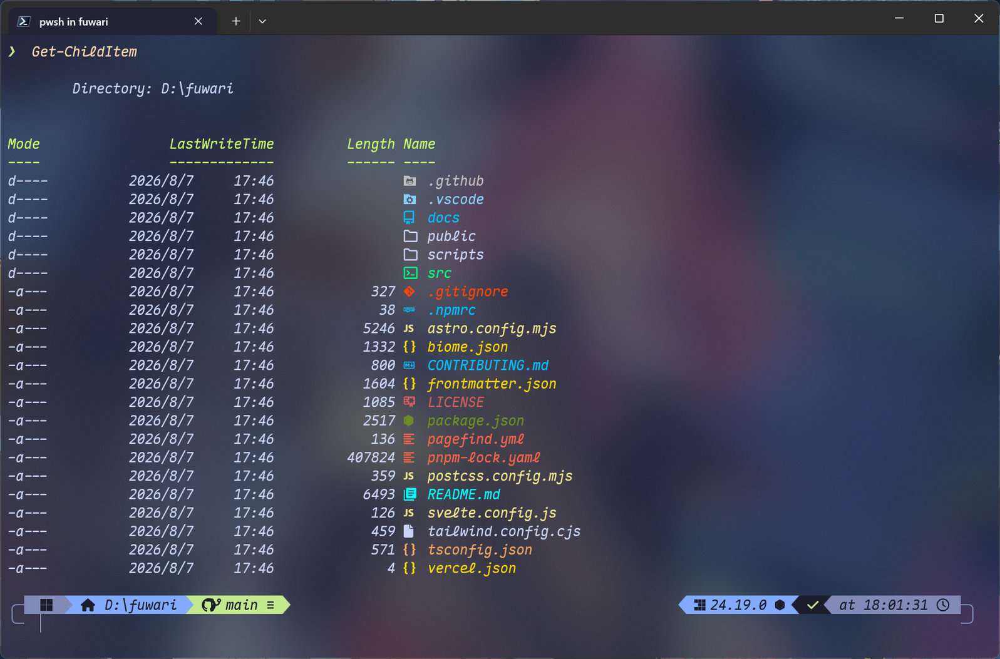
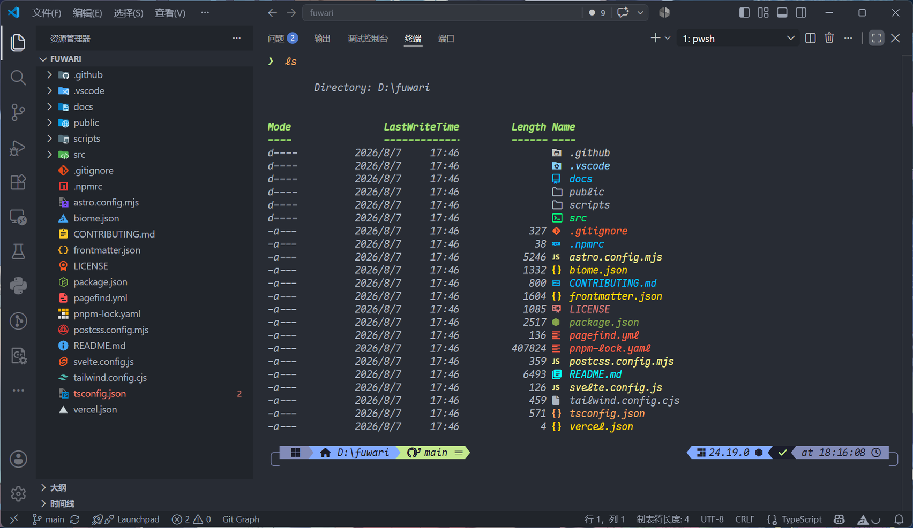
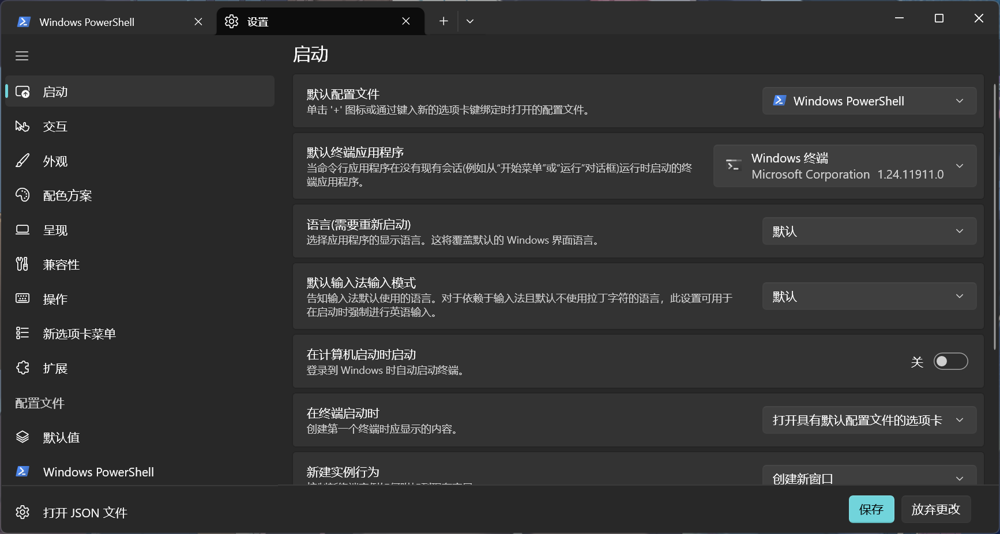
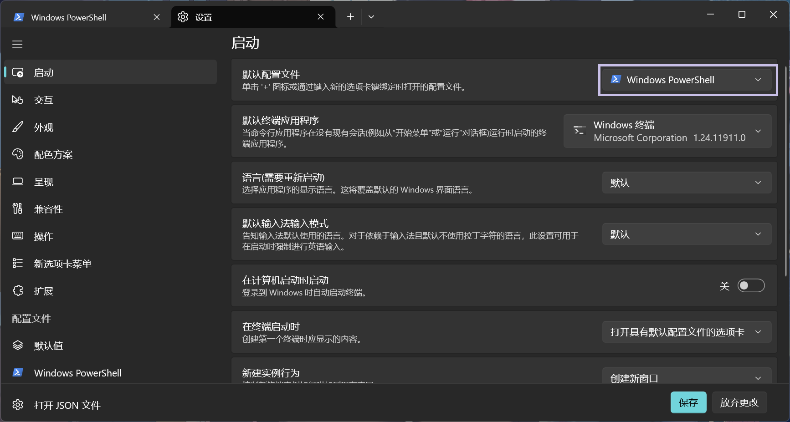
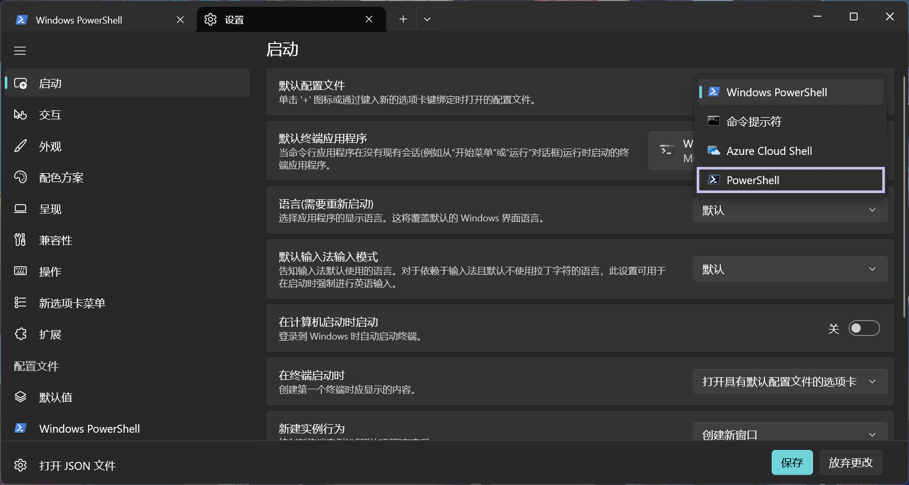
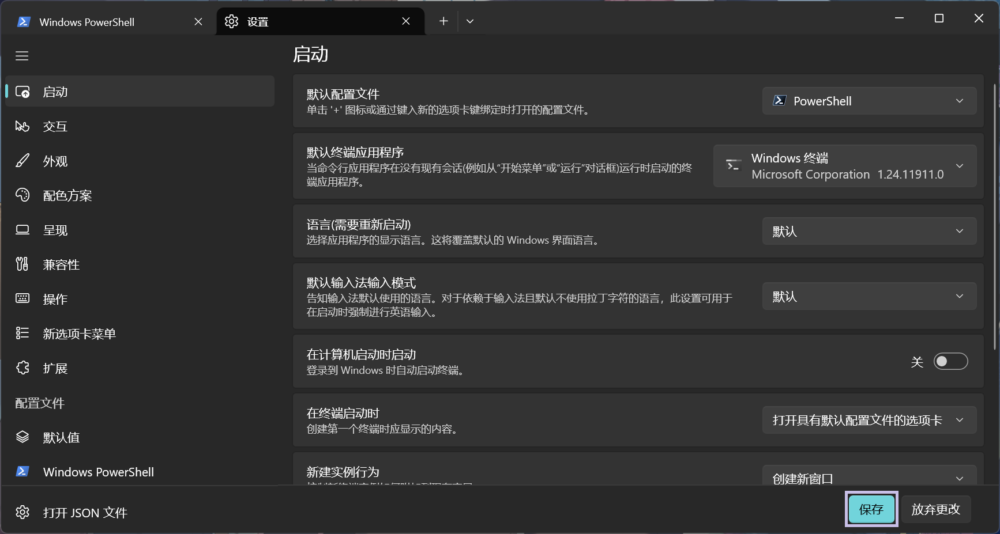
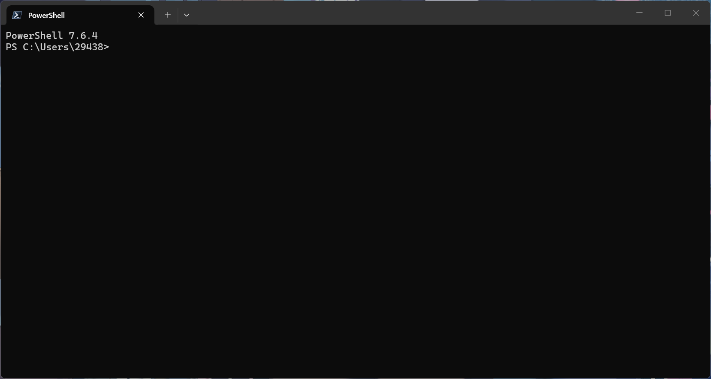

CMD 默认的黑底白字实在谈不上美观，Windows PowerShell 经典的蓝底白字也没有好到哪里去。习惯了 Linux 上由 `Kitty` + `Zsh` + `Oh My Zsh` 组成的命令行环境后，再回到 Windows 使用这些传统界面，难免会感到有些不习惯。好在借助 `Windows Terminal` + `PowerShell 7` + `Oh My Posh`，我们同样可以在 Windows 上打造一套美观、现代且实用的命令行环境。



<p align="center"><em>配置完成后在 Windows Terminal 中的效果示意。<br>由于启用了亚克力半透明效果，实际观感会随终端背后的桌面或窗口内容而变化。</em></p>



<p align="center"><em>配置完成后在 VS Code 中的效果示意。</em></p>

## 准备 PowerShell 7 环境

在开始美化命令行之前，需要先准备好两个基础组件：

- Windows Terminal：负责显示终端窗口。
- PowerShell 7：负责解释和执行命令。

本章将完成 Windows Terminal 和 PowerShell 7 的安装，并将 PowerShell 7 设置为 Windows Terminal 的默认 Shell。请根据自己的 Windows 版本和现有环境选择对应的操作。

### 安装 Windows Terminal

Windows Terminal 是 Microsoft 推出的现代终端应用，支持多标签页、Unicode 字符、GPU 加速、主题配色和个性化设置等功能，详情可见 [Windows 终端概述](https://learn.microsoft.com/zh-cn/windows/terminal/)。它本身不是 Shell，而是用于运行 PowerShell、CMD、WSL 等命令行环境的终端窗口。

- 在 Windows 11 上，Windows Terminal 已作为系统预置组件安装，可以直接在开始菜单中搜索并打开。

- 在 Windows 10 上，可以通过 [Microsoft Store](https://aka.ms/terminal) 来安装 Windows 终端，或者使用 WinGet：

  ```powershell frame="terminal" wrap
  winget install --id Microsoft.WindowsTerminal --exact --source winget
  ```

- 在无法使用 Microsoft Store 或 WinGet 的较低版本 Windows 上，可以在 [GitHub 发布页](https://github.com/microsoft/terminal/releases) 上手动下载和安装。

安装完成后，可以在开始菜单中搜索 `终端`，确认 Windows Terminal 能够正常启动。

### 安装 PowerShell 7

Windows 10 和 Windows 11 上已经预置了 Windows PowerShell，但是其版本为 PowerShell 5.1，因此需要额外安装 PowerShell 7。

> [!TIP]
>
> 可以在当前 PowerShell 窗口中运行以下命令，查看正在使用的 PowerShell 版本：
>
> ```powershell frame="terminal"
> $PSVersionTable.PSVersion
> ```
>
> PowerShell 目前有两个容易混淆的版本分支：
>
> - **Windows PowerShell 5.1**：Windows 自带的旧版 PowerShell，兼容现有的 Windows 管理脚本和工具。
>   - Windows 10 和 Windows 11 通常已经内置 Windows PowerShell 5.1，无需额外安装；
>   - 在未预装该版本的旧版 Windows，可以根据需要安装 [Windows Management Framework 5.1](https://www.microsoft.com/en-us/download/details.aspx?id=54616)。
> - **PowerShell 7**：基于现代 .NET 开发的新一代 PowerShell，支持 Windows、Linux 和 macOS，适合日常命令行操作、脚本编写、软件开发和跨平台自动化。它需要单独安装，并且可以与 Windows PowerShell 5.1 并存。详情请参考 [PowerShell 文档](https://aka.ms/powershell)。
>
> |        名称        |         安装方式         | PowerShell 版本系列 |     启动方式     |
> | :----------------: | :----------------------: | :-----------------: | :--------------: |
> | Windows PowerShell | Windows 10/11 系统内置 |   PowerShell 5.1    | `powershell.exe` |
> |     PowerShell     |       需要额外安装       |    PowerShell 7     |    `pwsh.exe`    |

PowerShell 7 支持多种安装方式。

- 在 Windows 10/11 中，可以通过 [Microsoft Store](https://www.microsoft.com/store/apps/9MZ1SNWT0N5D) 来安装，也可以使用 WinGet：

  ```powershell frame="terminal" wrap
  winget install --id Microsoft.PowerShell --exact --source winget
  ```

- 或者，如果已经配置好 Scoop，也可以通过 Scoop 安装：

  ```powershell frame="terminal"
  scoop install pwsh
  ```

  有关 Scoop 的安装和配置可以参考 [Scoop：Windows 命令行软件包管理器](/posts/scoopwindows-软件包管理器入门/)。

  使用 Scoop 安装 PowerShell 7 后，可能会看到以下提示：

  ```shellsession frame="terminal" wrap
  Notes
  -----
  Since Scoop uses pwsh.exe internally, to update PowerShell Core itself,
  run `scoop update pwsh` from Windows PowerShell, i.e. powershell.exe.
  Or run the following command from any other shell prompt (e.g., CMD or WSL):
  powershell.exe -Command "scoop update pwsh"

  For explorer context menu, run:
  reg import "drive:\path\to\scoop\apps\pwsh\current\install-explorer-context.reg"
  For file context menu, run:
  reg import "drive:\path\to\scoop\apps\pwsh\current\install-file-context.reg"
  ```

  这段提示主要包含两部分内容。

  首先，Scoop 本身使用 `pwsh.exe` 执行部分操作，因此更新 PowerShell 7 时，不要在 PowerShell 7 中直接运行更新命令，而应在 Windows PowerShell 5.1 中运行：

  ```powershell frame="terminal"
  scoop update pwsh
  ```

  或者在 PowerShell 7、CMD 或其他 Shell 中直接运行：

  ```powershell frame="terminal" wrap
  powershell.exe -Command "scoop update pwsh"
  ```

  其次，可以通过 Scoop 提供的注册表文件，在右键菜单中添加 PowerShell 7 的快捷入口，注意替换 `drive:\path\to\scoop` 为 Scoop 的实际安装地址：

  ```powershell frame="terminal" wrap
  # 在资源管理器背景右键菜单中添加 PowerShell
  reg import "drive:\path\to\scoop\apps\pwsh\current\install-explorer-context.reg"

  # 在文件和文件夹右键菜单中添加 PowerShell
  reg import "drive:\path\to\scoop\apps\pwsh\current\install-file-context.reg"
  ```

- 对于较低版本的 Windows，请参考 [在 Windows 上安装 PowerShell 7](https://learn.microsoft.com/zh-cn/powershell/scripting/install/install-powershell-on-windows)。

安装完成后，可以运行：

```powershell frame="terminal"
pwsh
```

然后检查版本：

```powershell frame="terminal"
$PSVersionTable.PSVersion
```

如果显示的主版本号为 `7`，说明 PowerShell 7 已经安装成功。

### 将 PowerShell 7 设置为默认 Shell

安装 PowerShell 7 后，还需要将它设置为 Windows Terminal 的默认配置文件。这样以后打开 Windows Terminal 时，就会直接进入 PowerShell 7，而不是 Windows PowerShell 5.1。

首先，打开 Windows Terminal，然后按下快捷键 `Ctrl + ,` 进入设置页面：



在左侧进入“启动”，点击“默认配置文件”右侧的下拉框，然后选择 `PowerShell`：





保存设置并重新打开 Windows Terminal。此时，终端默认启动的应该已经是 PowerShell 7：





至此，Windows Terminal 和 PowerShell 7 的基础环境已经准备完成。

## 安装 Oh My Posh 与字体

### 安装 Oh My Posh

Oh My Posh 是一个跨平台的命令提示符美化工具，支持 PowerShell、Bash、Zsh、Fish 等多种 Shell。它可以根据当前路径、Git 状态、命令执行结果和运行环境等信息，动态生成具有不同颜色和样式的提示符。

- 在 Windows 10/11 中，可以使用 WinGet 安装 Oh My Posh：

  ```powershell frame="terminal" wrap
  winget install --id JanDeDobbeleer.OhMyPosh --exact --source winget
  ```

- 如果已经配置好 Scoop，也可以通过 Scoop 安装：

  ```powershell frame="terminal"
  scoop install oh-my-posh
  ```

  Scoop 的安装和配置可以参考 [Scoop：Windows 命令行软件包管理器](/posts/scoopwindows-软件包管理器入门/)。

以上安装方式选择其中一种即可，不要通过多个包管理器重复安装。安装完成后，请重新打开终端窗口，以刷新环境变量，然后运行：

```powershell frame="terminal"
oh-my-posh version
```

如果能够正常输出版本号，说明 Oh My Posh 已经安装成功。

### 安装字体支持

Oh My Posh 负责生成 PowerShell 提示符，但提示符中的 Git 分支、文件夹、操作系统和状态图标，则是由终端按照字体中的字形进行渲染的。因此，安装 Oh My Posh 后，还需要为 Windows Terminal 配置一类包含所需图标的字体，这类字体称为 Nerd Font。

#### 选择和安装 Nerd Font

你可以在 [Nerd Fonts](https://www.nerdfonts.com/font-downloads) 中找到一款适合你的 Nerd Font。这里主要介绍以下两种字体：

|           字体            | Windows 中的字体家族名 | 说明                                 |
| :-----------------------: | :--------------------: | ------------------------------------ |
|      `Meslo LGM NF`       |  `MesloLGM Nerd Font`  | Oh My Posh 的推荐字体，兼容性较好    |
| `Maple Mono NF CN Italic` |   `Maple Mono NF CN`   | 支持中文等宽显示，斜体效果也更加美观 |

> [!TIP]
>
> 需要注意区分以下两个概念：
>
> - 字体家族名：字体系列的名字，例如 `Maple Mono NF CN`。
> - 字体名称或字形名称：字体家族中的某款具体字体名，通常会在字体家族名的基础上加入 `Italic`、`Regular`、`Bold` 等，用于区分斜体、字重等样式，例如 `Maple Mono NF CN Italic`。
>
> 在字体设置中，通常填写的都是字体家族名。

对于 `Meslo LGM NF`，可以直接通过 Oh My Posh 安装：

```powershell frame="terminal"
oh-my-posh font install Meslo
```

如果通过 Oh My Posh 下载字体时速度过慢、无法连接，或者希望使用其他字体，也可以手动下载并安装。

可以从前面提到的 [Nerd Fonts](https://www.nerdfonts.com/font-downloads) 中下载字体，也可以直接前往字体项目的 GitHub 仓库或官方网站。得到 `.ttf` 或 `.otf` 文件后，右键单击字体文件，然后选择“安装”或“为所有用户安装”。

更推荐使用的是 `Maple Mono NF CN Italic`。`Maple Mono` 是一款适合代码编辑和终端显示的等宽字体。其中，`NF` 表示该版本包含 Nerd Font 图标，`CN` 表示支持中文字符，`Italic` 表示使用斜体字形。可以点击下载 [Maple Mono NF CN Italic](/downloads/fonts/MapleMono-NF-CN-Italic.ttf) 字体，或者前往 [Maple Mono 官方网站](https://font.subf.dev/zh-cn/)获取其他版本。

#### 在 Windows Terminal 中选择 Nerd Font

字体安装完成后，还需要在 Windows Terminal 中配置使用字体。

打开 Windows Terminal，然后按下快捷键 `Ctrl + Shift + ,` 打开配置文件 `settings.json`，找到如下所示的 `profiles.defaults`：

```json title="settings.json" {5} frame="code"
{
    ...
    "profiles":
    {
        "defaults": {},
        "list":
        [
            ...
        ]
    }
    ...
}
```

然后在 `profiles.defaults` 中添加以下内容并保存：

```diff lang="json" title="settings.json" frame="code"
 {
     ...
     "profiles":
     {
-        "defaults": {},
+        "defaults":
+        {
+            "font":
+            {
+                "face": "<font-family-name>"
+            }
+        },
         "list":
         [
             ...
         ]
     }
     ...
 }
```

注意将 `<font-family-name>` 修改为想要使用的字体家族名（而不是字体名），例如：

- 使用 Oh My Posh 官方推荐中的 `Meslo LGM NF`：

  ```json frame="code"
  "face": "MesloLGM Nerd Font"
  ```

- 使用 `Maple Mono NF CN Italic`：

  ```json frame="code"
  "face": "Maple Mono NF CN"
  ```

如果不确定字体家族名，可以在 Windows 的字体设置中打开对应字体，查看其详细信息。

至此，Nerd Font 已经安装并应用到 Windows Terminal。

## 配置 Oh My Posh 和 PowerShell

### 预览和选择主题

Oh My Posh 提供了许多内置主题，你可以在 [Themes | Oh My Posh](https://ohmyposh.dev/docs/themes) 中预览所有内置主题。

找到喜欢的主题后，可以先在当前 PowerShell 会话中临时加载，例如 `powerlevel10k_rainbow`：

```powershell frame="terminal" wrap
oh-my-posh init pwsh --config "$env:POSH_THEMES_PATH\powerlevel10k_rainbow.omp.json" | Invoke-Expression
```

执行后，当前提示符会立即发生变化。由于这只是临时加载，因此关闭终端后不会保留。

除了官方主题，Oh My Posh 还支持自定义主题文件。这里使用的是基于 `powerlevel10k_rainbow` 修改的 `tokyo-night-moon` 主题，你可以点击[此处](/downloads/oh-my-posh-theme/tokyo-night-moon.omp.json)下载。

下载完成后，可以将主题文件复制到 Oh My Posh 的主题目录中：

```powershell frame="terminal" wrap
Copy-Item "$HOME\Downloads\tokyo-night-moon.omp.json" "$env:POSH_THEMES_PATH\tokyo-night-moon.omp.json"
```

然后临时加载：

```powershell frame="terminal" wrap
oh-my-posh init pwsh --config "$env:POSH_THEMES_PATH\tokyo-night-moon.omp.json" | Invoke-Expression
```

### 创建并编辑 `$PROFILE`

`$PROFILE` 是 PowerShell 的启动配置文件。当 PowerShell 启动时，会自动执行其中的命令，因此可以用它加载 Oh My Posh、导入 PowerShell 模块，以及设置别名和环境变量。

如果 `$PROFILE` 文件不存在，需要先执行以下命令创建：

```powershell frame="terminal"
if (-not (Test-Path $PROFILE)) {
    New-Item -Path $PROFILE -Type File -Force
}
```

该命令会检查 `$PROFILE` 文件是否存在，如果不存在则会自动创建。

然后使用记事本打开：

```powershell frame="terminal"
notepad $PROFILE
```

接着在文件末尾加上 Oh My Posh 的初始化命令，例如：

```powershell title="Microsoft.PowerShell_profile.ps1" frame="code" wrap
oh-my-posh init pwsh --config "drive:\path\to\your-theme.omp.json" | Invoke-Expression
```

注意将 `"drive:\path\to\your-theme.omp.json"` 改为主题文件的实际路径。

如果主题文件已经复制到 Oh My Posh 的主题目录中，可以使用：

```powershell title="Microsoft.PowerShell_profile.ps1" frame="code" wrap
oh-my-posh init pwsh --config "$env:POSH_THEMES_PATH\tokyo-night-moon.omp.json" | Invoke-Expression
```

注意将 `tokyo-night-moon.omp.json` 修改为主题文件名。

保存后，重新加载 `$PROFILE`：

```powershell frame="terminal"
. $PROFILE
```

> [!NOTE]
>
> 如果执行 `. $PROFILE` 时提示“在此系统上禁止运行脚本”，可以先查看当前的 PowerShell 执行策略：
>
> ```powershell frame="terminal"
> Get-ExecutionPolicy
> ```
>
> 如果确认需要允许运行本地配置脚本，可以将当前用户范围的执行策略设置为 RemoteSigned：
>
> ```powershell frame="terminal"
> Set-ExecutionPolicy -ExecutionPolicy RemoteSigned -Scope CurrentUser
> ```
>
> `RemoteSigned` 允许运行本地创建的脚本，但对于从互联网下载的脚本，则要求脚本具有可信数字签名，或由用户手动解除阻止。
>
> 设置完成后，重新执行：
>
> ```powershell frame="terminal"
> . $PROFILE
> ```

### （可选）安装 Terminal-Icons 和 CommandNotFound

PowerShell 支持安装多种模块，进一步改善日常使用体验。这里推荐 Terminal-Icons 和 CommandNotFound：

- Terminal-Icons：为 `Get-ChildItem` 或 `ls` 命令输出的文件和目录列表添加图标。
- CommandNotFound：输入不存在的命令时，尝试通过 WinGet 提供对应软件包的安装建议。

安装 Terminal-Icons 和 CommandNotFound：

```powershell frame="terminal"
Install-Module Terminal-Icons -Repository PSGallery
Install-Module Microsoft.WinGet.CommandNotFound -Repository PSGallery
```

首次使用 `Install-Module` 时，PowerShell 可能会询问是否安装 NuGet 提供程序或是否信任 PSGallery，按照提示确认即可。

安装完成后，在 `$PROFILE` 的开头加入：

```powershell title="Microsoft.PowerShell_profile.ps1" frame="code" wrap
Import-Module Terminal-Icons
Import-Module Microsoft.WinGet.CommandNotFound
```

最终的 `$PROFILE` 可以写成：

```powershell title="Microsoft.PowerShell_profile.ps1" frame="code" wrap
Import-Module Terminal-Icons
Import-Module Microsoft.WinGet.CommandNotFound
oh-my-posh init pwsh --config "$env:POSH_THEMES_PATH\tokyo-night-moon.omp.json" | Invoke-Expression
```

保存后重新加载配置文件：

```powershell frame="terminal"
. $PROFILE
```

可以运行以下命令进行测试：

```powershell frame="terminal"
Get-ChildItem
```

如果文件和目录前出现了对应图标，说明 Terminal-Icons 已经生效。

至此，Oh My Posh 主题和 PowerShell 扩展模块已经配置完成。

## 配置 Windows Terminal 外观

Oh My Posh 只负责提示符的内容和样式，终端的外观和交互行为仍然由 Windows Terminal 控制。

### 通用设置

打开 Windows Terminal，按下 `Ctrl + Shift + ,` 打开 `settings.json`，在文件顶部可以看到类似以下内容：

```json title="settings.json" {3} frame="code"
{
    "$help": "https://aka.ms/terminal-documentation",
    "$schema": "https://aka.ms/terminal-profiles-schema",
    ...
}
```

在 `"$schema"` 行的下一行，加入下面的内容，注意修改缩进：

```diff lang="json" title="settings.json" frame="code"
 {
     "$help": "https://aka.ms/terminal-documentation",
     "$schema": "https://aka.ms/terminal-profiles-schema",
+    "copyOnSelect": true,
+    "defaultInputScope": "alphanumericHalfWidth",
+    "experimental.scrollToChangeOpacity": false,
+    "experimental.scrollToZoom": false,
+    "warning.confirmCloseAllTabs": false
     ...
 }
```

各项设置的作用如下：

1. `copyOnSelect`：选中文本后是否自动将其复制到剪贴板。此处将其开启。
2. `defaultInputScope`：设置终端启动时的默认输入模式。对于中文输入法用户来说，打开终端时可能无法立即确认当前处于中文还是英文输入模式。将其设置为 `alphanumericHalfWidth`，可以让 Windows Terminal 启动后默认使用半角英文输入。
3. `experimental.scrollToChangeOpacity`：是否允许按住 `Ctrl + Shift` 并滚动鼠标滚轮，以调整终端背景不透明度。此处将其关闭。
4. `experimental.scrollToZoom`：是否允许按住 `Ctrl` 并滚动鼠标滚轮，以调整终端字体大小。此处将其关闭。
5. `warning.confirmCloseAllTabs`：关闭包含多个标签页的 Windows Terminal 窗口时，是否显示确认提示。此处将其关闭。

这些配置都是可选项。如果不符合自己的使用习惯，可以省略对应字段。

### 个性化设置

完成通用行为设置后，可以继续调整 Windows Terminal 的外观。

#### 设置配色方案

打开 Windows Terminal，然后按下 `Ctrl + Shift + ,` 打开 `settings.json`，找到 `schemes`：

```json title="settings.json" {3} frame="code"
{
    ...
    "schemes": [],
    ...
}
```

将其修改为以下内容：

```diff lang="json" title="settings.json" frame="code"
 {
     ...
-    "schemes": [],
+    "schemes":
+    [
+        {
+            "name": "Tokyo Night Moon",
+            "background": "#222436",
+            "selectionBackground": "#2D3F76",
+            "black": "#1B1D2B",
+            "blue": "#82AAFF",
+            "brightBlack": "#444A73",
+            "brightBlue": "#9AB8FF",
+            "brightCyan": "#B2EBFF",
+            "brightGreen": "#C7FB6D",
+            "brightPurple": "#CAABFF",
+            "brightRed": "#FF8D94",
+            "brightWhite": "#C8D3F5",
+            "brightYellow": "#FFD8AB",
+            "cursorColor": "#C8D3F5",
+            "cyan": "#86E1FC",
+            "foreground": "#C8D3F5",
+            "green": "#C3E88D",
+            "purple": "#C099FF",
+            "red": "#FF757F",
+            "white": "#828BB8",
+            "yellow": "#FFC777"
+        }
+    ],
     ...
 }
```

这段配置添加了一个名为 `Tokyo Night Moon` 的配色方案，配合[预览和选择主题](#预览和选择主题)中提到的 `tokyo-night-moon` 主题效果更佳。

接着找到如下所示的 `profiles.defaults`：

```json title="settings.json" {5-11} frame="code"
{
    ...
    "profiles":
    {
        "defaults":
        {
            "font":
            {
                "face": "<font-family-name>"
            }
        },
        ...
    }
    ...
}
```

然后在 `profiles.defaults` 中添加以下字段并保存：

```diff lang="json" title="settings.json" frame="code"
 {
     ...
     "profiles":
     {
         "defaults":
         {
+            "adjustIndistinguishableColors": "never",
+            "colorScheme": "Tokyo Night Moon",
             "font":
             {
                 "face": "<font-family-name>"
             }
         },
         ...
     }
     ...
 }
```

设置说明：

1. `"adjustIndistinguishableColors": "never"`：不允许为了增加可读性而调整文本亮度，防止颜色偏移。
2. `"colorScheme": "Tokyo Night Moon"`：将刚才添加的 `Tokyo Night Moon` 方案设置为默认配色方案。

#### 设置亚克力背景

Windows Terminal 支持亚克力材质，可以在保留背景颜色的同时加入半透明和模糊效果。

继续在 `profiles.defaults` 中添加：

```diff lang="json" title="settings.json" frame="code"
 {
     ...
     "profiles":
     {
         "defaults":
         {
             "adjustIndistinguishableColors": "never",
             "colorScheme": "Tokyo Night Moon",
             "font":
             {
                 "face": "<font-family-name>"
-            }
+            },
+            "useAcrylic": true,
+            "opacity": 65
         },
         ...
     }
     ...
 }
```

设置说明：

1. `useAcrylic`：在终端窗口的背景中启用亚克力效果。
2. `opacity`：设置亚克力材料的不透明度。可以根据桌面背景和个人喜好进行调整。

保存 `settings.json` 后，Windows Terminal 会立即应用新配置。

### 隐藏 PowerShell 启动信息

在启动 Windows Terminal 时，默认打开的 PowerShell 可能会输出类似下面的启动信息：

```shellsession frame="terminal"
PowerShell 7.6.4
Loading personal and system profiles took 660ms.
```

若要隐藏这些启动信息，可以按以下步骤修改 Windows Terminal 中 PowerShell 配置文件的启动命令：

1. 打开 Windows Terminal，按下快捷键 `Ctrl + ,` 进入设置页面。

2. 在左侧的“配置文件”中选择 PowerShell。

3. 在右侧找到“命令行”，在原有路径后添加 `-NoLogo` 参数，例如：

   ```text ins="-NoLogo" frame="none" wrap
   "C:\Program Files\PowerShell\7\pwsh.exe" -NoLogo
   ```

保存后，重新打开一个 PowerShell 窗口，现在 PowerShell 启动时便不再显示启动信息了。

## 在 VS Code 中使用 PowerShell

Windows Terminal 和 VS Code 集成终端是两个不同的终端程序。虽然它们都可以运行 PowerShell 7，并加载相同的 `$PROFILE`，但字体和默认 Shell 都需要分别设置。

### 设置默认配置文件

在 VS Code 中按下 `Ctrl + Shift + P` 打开命令面板，然后搜索并运行：

```text frame="none"
Terminal: Select Default Profile
```

在列表中选择 `PowerShell`。

也可以按下 `Ctrl + ,` 打开设置，搜索：

```text frame="none"
terminal.integrated.defaultProfile.windows
```

然后将其设置为 `PowerShell`。

### 设置终端的字体

按下快捷键 `Ctrl + ,` 打开设置，然后搜索：

```text frame="none"
terminal.integrated.fontFamily
```

填入之前安装的 Nerd Font 字体家族名，例如：

```text frame="none"
Maple Mono NF CN
```

或者：

```text frame="none"
MesloLGM Nerd Font
```

设置将在重新打开集成终端后生效。

需要注意的是，VS Code 编辑器字体和集成终端字体是两个不同的设置：

- `editor.fontFamily`：控制代码编辑器使用的字体；
- `terminal.integrated.fontFamily`：控制集成终端使用的字体。

如果只想修改终端字体，设置 `terminal.integrated.fontFamily` 即可。

## 参考资料

- HanzonoSerenya's Cafe：[✨️美化你的 Windows 终端 | Oh My Posh 安装教程](https://blog.hananya.cafe/archives/ohmyposh-tutorial)
- Oh My Posh 官方文档：[Windows | Oh My Posh](https://ohmyposh.dev/docs/installation/windows)
